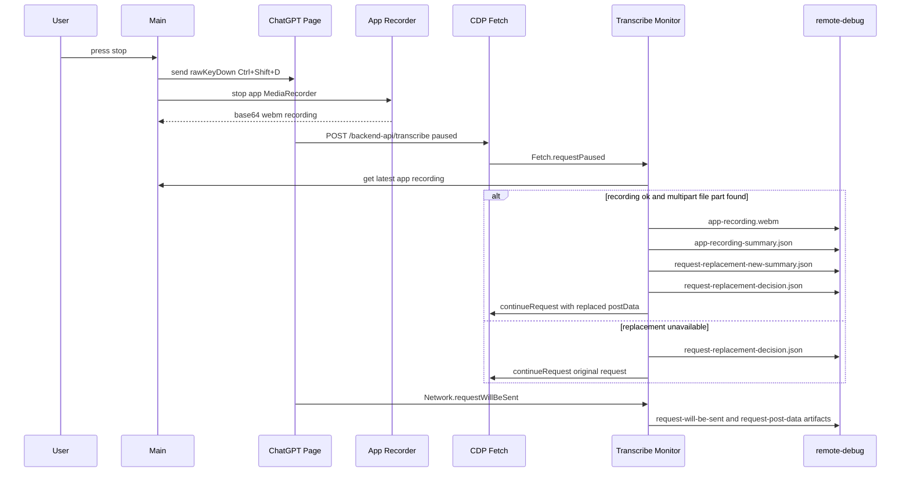

# App 侧录音替换 ChatGPT 上传音频

## 当前结论

已经实现 request replacement，并在当前 [`../config/dandelion.json`](../config/dandelion.json) 里显式开启：

```json
{
  "transcribe": {
    "replaceUploadWithAppRecording": true,
    "uploadReplacementWaitMs": 5000
  }
}
```

代码默认值仍是 `false`。也就是说：没有配置时不会改 ChatGPT 上传内容；当前这份 repo 配置和 packaged 资源配置会打开替换。

## 为什么不用 Electron `webRequest`

Electron `webRequest.onBeforeRequest` 能看到 request 的 `uploadData`，但 callback 只提供 `cancel` 和 `redirectURL`。它适合观察、取消、重定向，不适合原地替换 POST body。

现在使用 Chrome DevTools Protocol `Fetch` domain：

- `Fetch.enable` 让匹配的 transcribe request 在 request stage pause。
- `Fetch.requestPaused` 给出原始 request、headers 和 postData。
- `Fetch.continueRequest` 用新的 `headers` 和 base64 `postData` 继续 request。

官方文档：

- Electron `webRequest`: https://www.electronjs.org/docs/latest/api/web-request
- CDP `Fetch.continueRequest`: https://chromedevtools.github.io/devtools-protocol/tot/Fetch/#method-continueRequest

## 现在 stop 后发生什么



## 新增代码

- [`../src/main/chatgptAppRecorder.js`](../src/main/chatgptAppRecorder.js)：在 ChatGPT 页面里启动/停止 app 自己的 `MediaRecorder`，导出 base64 `webm`。
- [`../src/main/chatgptUploadReplacement.js`](../src/main/chatgptUploadReplacement.js)：解析 multipart body，只替换 `name="file"` 的 bytes，保留其他 form fields。
- [`../src/main/chatgptTranscribeMonitor.js`](../src/main/chatgptTranscribeMonitor.js)：启用 CDP Fetch，在 request stage pause transcribe request；替换成功就 `continueRequest(headers, postData)`，失败就放行原始 request。
- [`../src/main/main.js`](../src/main/main.js)：start 前启动 app recorder，stop 后停止 app recorder，并把 recording 提供给 monitor。

## Remote Debug Artifact

每条命中的 request 会写在：

```text
remote-debug/transcribe/<timestamp>/<requestId>/
```

关键文件：

- `request-replacement-paused.json`：Fetch pause 的原始 request。
- `request-replacement-decision.json`：是否替换、失败原因、bytes delta。
- `request-replacement-new-summary.json`：替换后的 body 摘要。
- `app-recording.webm`：实际用于替换的 app 录音。
- `app-recording-summary.json`：录音 bytes、duration、chunk count、mimeType。
- `request-post-data.json`：Network 看到的 request post data，用来核对替换后的上传。
- `response-body.json`：ChatGPT remote 返回和解析出的 transcript。

## 降级行为

这些情况都会放行 ChatGPT 原始 request：

- app recorder start / stop 失败。
- app recording 为空。
- Fetch pause 后超过 `uploadReplacementWaitMs` 仍没拿到录音。
- request body 不是可识别 multipart。
- multipart 里找不到 `name="file"` part。
- CDP Fetch enable / continue 失败。

所以替换链路的目标是“有 app 录音就保险替换”，不是让听写依赖这条链路才能继续。

## 相关文档

- [`../.doc/modules/chatgpt-app-recorder.md`](../.doc/modules/chatgpt-app-recorder.md)
- [`../.doc/modules/chatgpt-upload-replacement.md`](../.doc/modules/chatgpt-upload-replacement.md)
- [`../.doc/modules/chatgpt-transcribe-monitor.md`](../.doc/modules/chatgpt-transcribe-monitor.md)
- [`./2026-06-06-general-stt-current-flow.md`](./2026-06-06-general-stt-current-flow.md)
