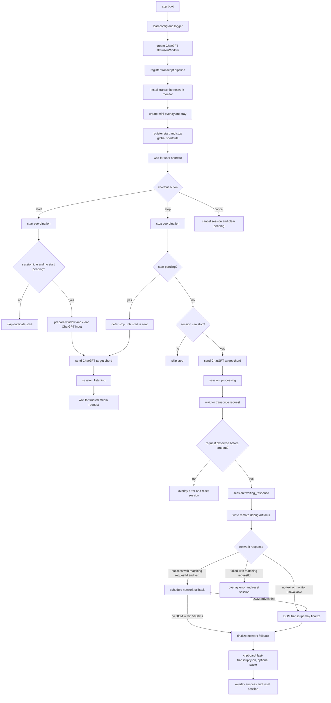
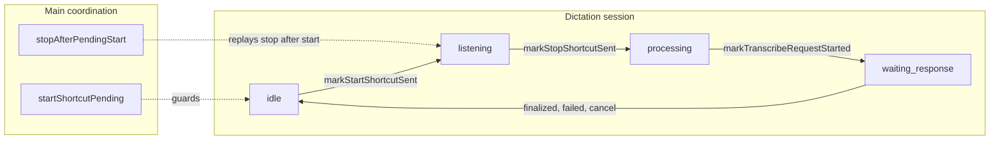
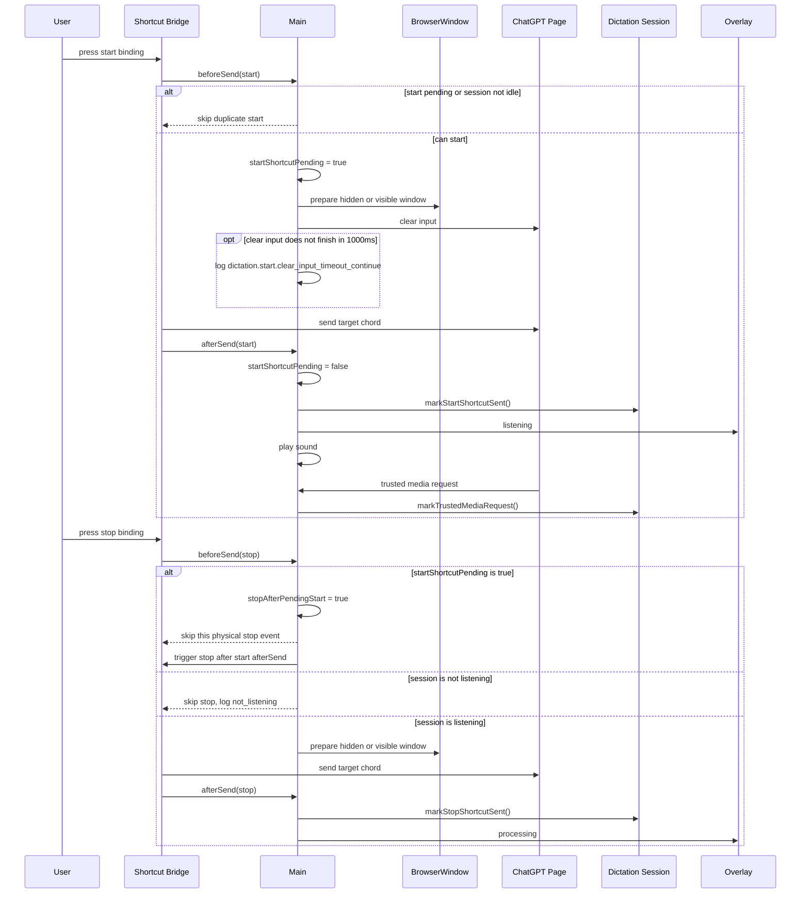
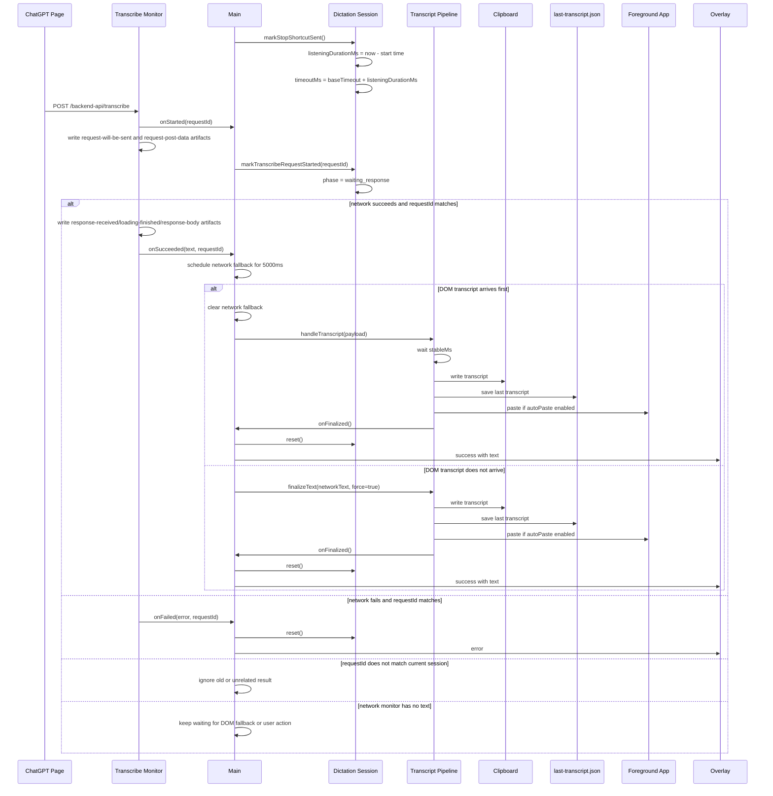
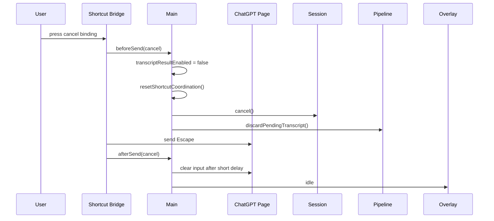

# General STT 当前整体流程

这份图按当前代码画，重点覆盖最近改过的 start pending / deferred stop，以及 transcribe request 到 transcript finalized 的路径。

主要代码入口：

- [`../src/main/main.js`](../src/main/main.js)
- [`../src/main/dictationSession.js`](../src/main/dictationSession.js)
- [`../src/main/chatgptTranscribeMonitor.js`](../src/main/chatgptTranscribeMonitor.js)
- [`../src/main/transcriptPipeline.js`](../src/main/transcriptPipeline.js)

## 1. 总览



## 2. 当前状态分层

这里有两层状态，不要混在一起看：



`startShortcutPending` 不是 `dictationSession` 的 phase。它只表示 main process 已经进入 start `beforeSend`，但 ChatGPT shortcut 还没真正发出去。

`stopAfterPendingStart` 也不是 session phase。它表示 stop 在 start pending 期间到达，当前不会丢掉，会等 start `afterSend` 后自动触发一次 stop。

## 3. Start / Stop 时序



关键点：

- duplicate start 会跳过，避免重复发送 `Ctrl+Shift+D` 把 ChatGPT 的听写开关翻乱。
- start pending 时的 stop 不再丢弃，而是 deferred stop。
- stop 只有在 session 已经是 `listening` 时才会真正发给 ChatGPT。

## 4. Stop 后到结果完成



这里的 `transcribe.succeeded` 和 `transcript.finalized` 不是同一个阶段：

- `transcribe.succeeded`：network monitor 已经拿到并解析 ChatGPT transcribe response；它现在只会 schedule 一个 network fallback，不会马上落盘。
- `transcript.finalized`：本地 pipeline 已经写 clipboard、保存 `last-transcript.json`，并按配置粘贴到前台 app。

每条 remote request 的完整 CDP artifact 会写到 `remote-debug/transcribe/<timestamp>/<requestId>/`。普通日志里的 `remoteDebugDir` 指向这个目录。

## 5. Cancel 分支



cancel 会清理 main coordination 状态，因此 pending start 或 deferred stop 都不会继续执行。

## 6. 读日志时按这个顺序看

正常一轮：

```text
dictation.start.before_send
dictation.start.sent_waiting_for_media_request
dictation.start.confirmed
dictation.stop.before_send
dictation.stop.sent_waiting_for_transcribe_request
transcribe.started
dictation.transcribe_request.observed
transcribe.succeeded
transcribe.network_fallback_scheduled
transcript.pipeline.finalized
transcript.finalized
mini_overlay.state.changed success
```

start pending 时 stop 早到：

```text
dictation.start.before_send
dictation.stop.deferred_until_start_sent
dictation.start.sent_waiting_for_media_request
dictation.stop.deferred_triggered
dictation.stop.before_send
dictation.stop.sent_waiting_for_transcribe_request
```

重复 start：

```text
dictation.start.skipped_active_session
```

清空输入栏卡住但继续开始：

```text
dictation.start.before_send
dictation.start.clear_input_timeout_continue
dictation.start.sent_waiting_for_media_request
```

stop 后没有看到 request：

```text
dictation.stop.sent_waiting_for_transcribe_request
dictation.transcribe_request.timeout
mini_overlay.state.changed error
```

## 7. 对应代码位置

- main coordination 状态：[`../src/main/main.js`](../src/main/main.js) 的 `startShortcutPending`、`stopAfterPendingStart`。
- start 清空输入兜底：[`../src/main/main.js`](../src/main/main.js) 的 `clearChatGptInputBeforeStart()`。
- deferred stop：[`../src/main/main.js`](../src/main/main.js) 的 `deferStopUntilStartShortcutSent()` 和 `triggerDeferredStopAfterStart()`。
- start / stop beforeSend 和 afterSend：[`../src/main/main.js`](../src/main/main.js) 的 `createDictationBridge()`。
- session phase 转换：[`../src/main/dictationSession.js`](../src/main/dictationSession.js) 的 `markStartShortcutSent()`、`markStopShortcutSent()`、`markTranscribeRequestStarted()`。
- network request 和 requestId matching：[`../src/main/main.js`](../src/main/main.js) 的 `installTranscribeMonitor()`。
- remote raw artifact：[`../src/main/chatgptTranscribeMonitor.js`](../src/main/chatgptTranscribeMonitor.js) 写入 `remote-debug/transcribe`。
- clipboard、保存和粘贴：[`../src/main/transcriptPipeline.js`](../src/main/transcriptPipeline.js)。
