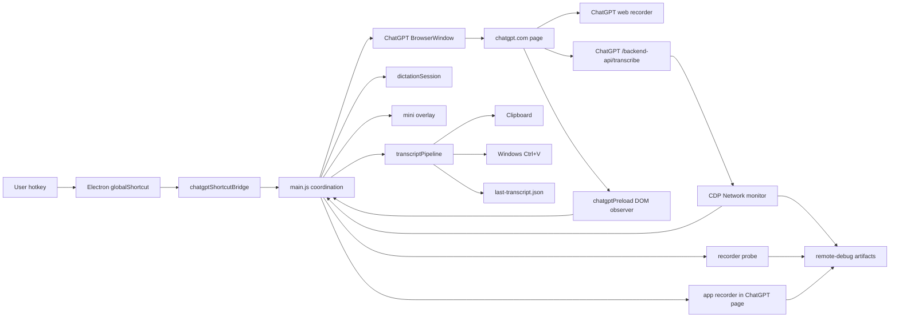
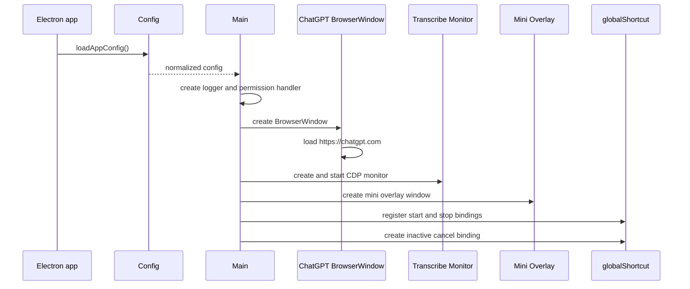
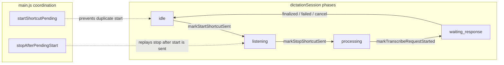
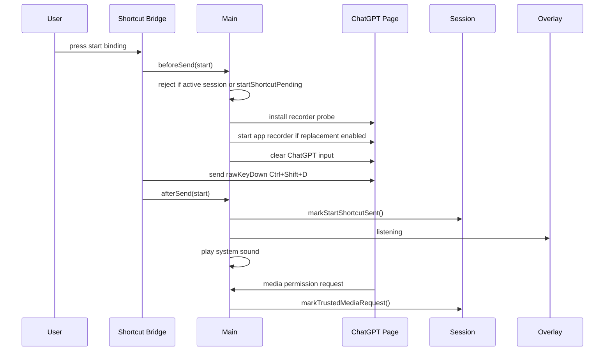
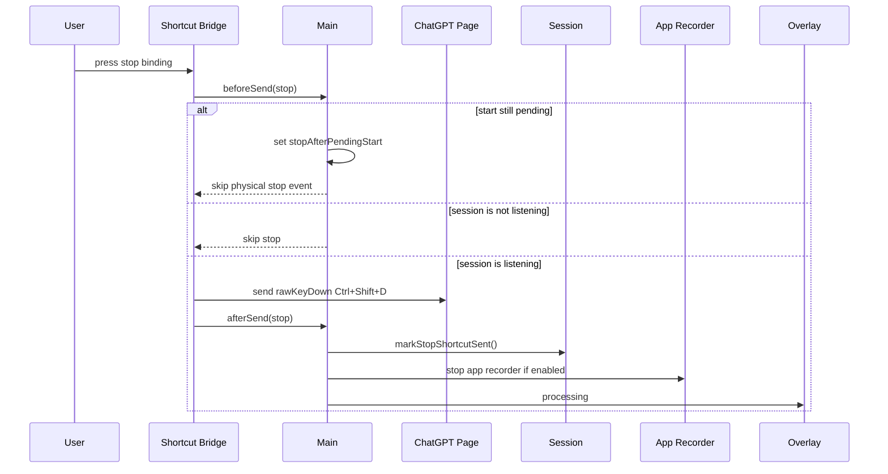
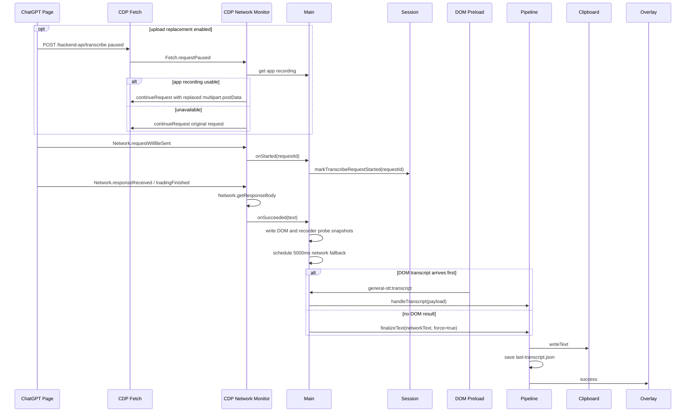
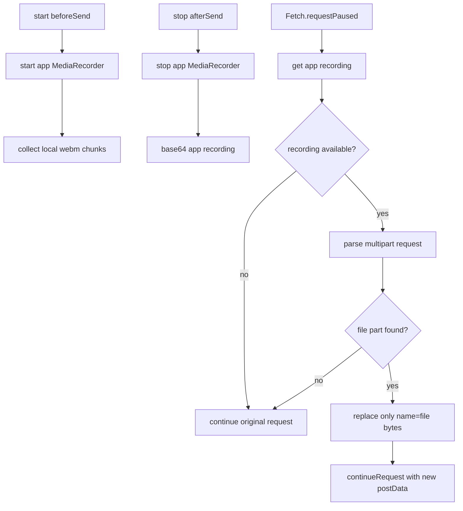

# General STT Project Onboarding

这份文档给第一次接手这个 repo 的人用。目标不是列完所有函数，而是让你知道：

- 这个 app 解决什么问题。
- 代码从哪里启动。
- start / stop / cancel / transcribe 的流程怎么走。
- 各模块之间怎么配合。
- 出问题时先看哪些日志和 artifact。

## 1. 这个项目是什么

Dandelion 是一个 Windows Electron STT helper。它内嵌 `https://chatgpt.com`，用自定义全局快捷键控制 ChatGPT 网页听写，然后把转写结果复制到剪贴板并可选粘贴到当前前台 app。

当前默认交互：

- start：`Alt+,`
- stop：`Alt+.`
- cancel：`Escape`，只在听写活跃时注册
- 发给 ChatGPT 网页的目标快捷键：`Ctrl+Shift+D`

主要入口：

- app main process：[`../src/main/main.js`](../src/main/main.js)
- config：[`../src/main/appConfig.js`](../src/main/appConfig.js)、[`../config/dandelion.json`](../config/dandelion.json)
- ChatGPT shortcut bridge：[`../src/shortcut/chatgptShortcutBridge.js`](../src/shortcut/chatgptShortcutBridge.js)
- session state：[`../src/main/dictationSession.js`](../src/main/dictationSession.js)
- transcribe monitor：[`../src/main/chatgptTranscribeMonitor.js`](../src/main/chatgptTranscribeMonitor.js)
- transcript pipeline：[`../src/main/transcriptPipeline.js`](../src/main/transcriptPipeline.js)

## 2. 仓库地图

```text
assets/                 app icon source and generated ico/png
config/                 default runtime config
src/main/               Electron main process modules
src/preload/            preload scripts for ChatGPT page and mini overlay
src/renderer/           mini overlay UI
src/shortcut/           global shortcut -> ChatGPT web shortcut bridge
tests/                  module tests, run through tests/run-tests.js
.doc/modules/           module-level technical docs
.chat/                  investigation notes and long-form explanations
dist/win-unpacked/      packaged Windows dir output
```

Detailed module docs live under [`../.doc/modules/`](../.doc/modules/). Use this onboarding doc first, then jump into module docs when you need exact API behavior.

## 3. High-Level Architecture



Key idea: `main.js` is the orchestrator. Most other files are small modules that each own one boundary: config, shortcuts, window visibility, session state, remote request monitoring, DOM extraction, logging, paste, and packaging.

## 4. Runtime Boot Flow



Important boot details:

- Dev mode uses `.runtime/dandelion-electron` as userData.
- Packaged mode uses `%APPDATA%\Dandelion`.
- Packaged config is `dist/win-unpacked/resources/config/dandelion.json`.
- ChatGPT login/session is stored in Electron persistent partition `persist:chatgpt`.
- The ChatGPT `BrowserWindow` uses `backgroundThrottling: false` so hidden/mini mode should not throttle `MediaRecorder`.

## 5. Window Model

There are two visible surfaces:

- Main ChatGPT window: the real browser that loads `chatgpt.com`.
- Mini overlay: local `file://` UI that shows idle/listening/processing/success/error.

In `mini` mode, the ChatGPT window is normally hidden. When a shortcut fires, the app temporarily moves the ChatGPT window offscreen, sets it transparent, focuses its `WebContents`, sends the web shortcut, then restores the previous foreground app.

Relevant files:

- [`../src/main/windowModes.js`](../src/main/windowModes.js)
- [`../src/main/shortcutWindowActivation.js`](../src/main/shortcutWindowActivation.js)
- [`../src/main/miniOverlayWindow.js`](../src/main/miniOverlayWindow.js)
- [`../src/main/miniOverlayState.js`](../src/main/miniOverlayState.js)

## 6. State Model

There are two separate state layers. Keep them separate when debugging.



`startShortcutPending` is not a dictation phase. It only means `beforeSend(start)` has started, but the actual web shortcut has not been sent yet.

`stopAfterPendingStart` means the user pressed stop while start was still preparing. The app stores that stop and triggers it after start `afterSend`.

## 7. Start Flow



Start is confirmed by a trusted `media` permission request from ChatGPT. If that signal does not arrive within the confirmation window, the app retries start once.

## 8. Stop Flow



After stop, the app waits for ChatGPT to send a transcribe request. The timeout is:

```text
transcribeRequestTimeoutMs = 15000 + listeningDurationMs
```

This timeout only checks whether a request appears. Once the request appears, the app waits for response / DOM / cancel / failure rather than using a fixed response timeout.

## 9. Transcribe Request And Result Flow



Important distinction:

- `transcribe.succeeded`: Network monitor fetched and parsed ChatGPT transcribe response.
- `transcript.finalized`: local pipeline wrote clipboard/storage and optionally pasted into the previous foreground app.

These are not the same stage.

## 10. Upload Replacement

Current config enables:

```json
{
  "transcribe": {
    "replaceUploadWithAppRecording": true,
    "uploadReplacementWaitMs": 5000
  }
}
```

The intended replacement chain is:



Relevant files:

- [`../src/main/chatgptAppRecorder.js`](../src/main/chatgptAppRecorder.js)
- [`../src/main/chatgptUploadReplacement.js`](../src/main/chatgptUploadReplacement.js)
- [`../src/main/chatgptTranscribeMonitor.js`](../src/main/chatgptTranscribeMonitor.js)

Important caveat from the current investigation: `app-recording.webm` is a local artifact, but it is not a native OS recording. It is still produced by Chromium `MediaRecorder` inside the ChatGPT `WebContents`. If that WebContents is hidden, throttled, or otherwise not receiving continuous audio frames, the local app recording can also be short.

## 11. Logging And Artifacts

Normal app log:

```text
Dev:       .runtime/dandelion-electron/logs/app-YYYY-MM-DD.log
Packaged:  %APPDATA%\Dandelion\logs\app-YYYY-MM-DD.log
```

Remote debug artifact:

```text
Dev:       .runtime/dandelion-electron/remote-debug/transcribe/<timestamp>/<requestId>/
Packaged:  %APPDATA%\Dandelion\remote-debug\transcribe\<timestamp>\<requestId>\
```

Key remote files:

- `request-replacement-paused.json`: Fetch pause event.
- `request-replacement-decision.json`: whether replacement happened and why.
- `request-replacement-new-summary.json`: replacement bytes summary.
- `app-recording.webm`: app recorder output.
- `app-recording-summary.json`: app recorder bytes / duration / chunk count.
- `request-will-be-sent.json`: Network request metadata.
- `request-post-data.json`: Network post body as Chromium exposes it.
- `response-body.json`: remote transcript response body and parsed transcript text.
- `dom-snapshot-*.json`: DOM state after response or before fallback.
- `recorder-probe-*.json`: page-side recorder / FormData / fetch / XHR events.

## 12. How To Debug Missing Tail

When the final transcript is missing the second half, do not start from the final text. Start from the artifacts.

Recommended order:

1. Find latest `transcribe.started` in app log.
2. Open its `remoteDebugDir`.
3. Read `response-body.json`: did remote return full text?
4. Read `request-post-data.json`: how large was the uploaded `file` part?
5. Read `request-replacement-decision.json`: did replacement claim success?
6. Compare uploaded file bytes with `app-recording.webm`.
7. Use `ffprobe` / `ffmpeg` to check decodable duration.

Why `ffmpeg` can output a shorter local recording:

- The app recorder summary `durationMs` is wall-clock time from JS start to JS stop.
- The actual audio is the encoded packets inside `app-recording.webm`.
- `ffmpeg` does not invent missing audio. It decodes whatever packets exist in the WebM.
- If Chromium `MediaRecorder` was throttled, suspended, or did not receive continuous audio frames, the Blob can represent less audio than the wall-clock duration.
- In that case `ffmpeg` output being short is evidence that the local recording artifact itself is short or has gaps; it is not evidence that `ffmpeg` cut off valid audio.

Useful commands:

```bash
ffprobe -v error -show_entries format=duration,size,bit_rate \
  -of json /path/to/app-recording.webm
```

```bash
ffmpeg -hide_banner -nostdin -i /path/to/app-recording.webm \
  -f null - 2>&1 | tail -n 30
```

If `app_recorder.stopped.durationMs` is much larger than `ffmpeg` decoded time, the problem is at recording/capture level, before transcribe response parsing.

## 13. Common Tasks And Files

| Task | Start here |
| --- | --- |
| Change global hotkeys | [`../config/dandelion.json`](../config/dandelion.json), [`../src/main/appConfig.js`](../src/main/appConfig.js) |
| Change web shortcut simulation | [`../src/shortcut/chatgptShortcutBridge.js`](../src/shortcut/chatgptShortcutBridge.js) |
| Change start / stop session rules | [`../src/main/dictationSession.js`](../src/main/dictationSession.js), [`../src/main/main.js`](../src/main/main.js) |
| Change ChatGPT window behavior | [`../src/main/windowModes.js`](../src/main/windowModes.js), [`../src/main/shortcutWindowActivation.js`](../src/main/shortcutWindowActivation.js) |
| Change overlay UI | [`../src/renderer/miniOverlay.html`](../src/renderer/miniOverlay.html), [`../src/renderer/miniOverlay.css`](../src/renderer/miniOverlay.css), [`../src/renderer/miniOverlay.js`](../src/renderer/miniOverlay.js) |
| Change remote request monitoring | [`../src/main/chatgptTranscribeMonitor.js`](../src/main/chatgptTranscribeMonitor.js) |
| Change upload replacement | [`../src/main/chatgptUploadReplacement.js`](../src/main/chatgptUploadReplacement.js) |
| Change app recorder | [`../src/main/chatgptAppRecorder.js`](../src/main/chatgptAppRecorder.js) |
| Change transcript copy/paste | [`../src/main/transcriptPipeline.js`](../src/main/transcriptPipeline.js), [`../src/main/windowsPaste.js`](../src/main/windowsPaste.js) |
| Change logs | [`../src/main/appLogger.js`](../src/main/appLogger.js) |
| Change packaged output | [`../package.json`](../package.json), [`../.doc/modules/windows-packaging.md`](../.doc/modules/windows-packaging.md) |

## 14. Test And Packaging Commands

Use Node directly when `npm` is not available in the current shell:

```bash
node tests/run-tests.js
```

If the shell has nvm but did not load it:

```bash
export NVM_DIR="$HOME/.nvm"
. "$NVM_DIR/nvm.sh"
npm test
```

Pack Windows dir:

```bash
export NVM_DIR="$HOME/.nvm"
. "$NVM_DIR/nvm.sh"
npm run pack:win
```

Packaged executable:

```text
dist/win-unpacked/Dandelion.exe
```

## 15. First-Day Checklist

1. Read [`../README.md`](../README.md).
2. Run `node tests/run-tests.js`.
3. Open [`../src/main/main.js`](../src/main/main.js) and identify the boot, bridge, pipeline, and monitor registration sections.
4. Read [`../.doc/modules/electron-app-runtime.md`](../.doc/modules/electron-app-runtime.md).
5. Read [`./2026-06-06-general-stt-current-flow.md`](./2026-06-06-general-stt-current-flow.md).
6. For missing-tail issues, read [`./2026-06-06-latest-log-missing-tail-analysis.md`](./2026-06-06-latest-log-missing-tail-analysis.md).
