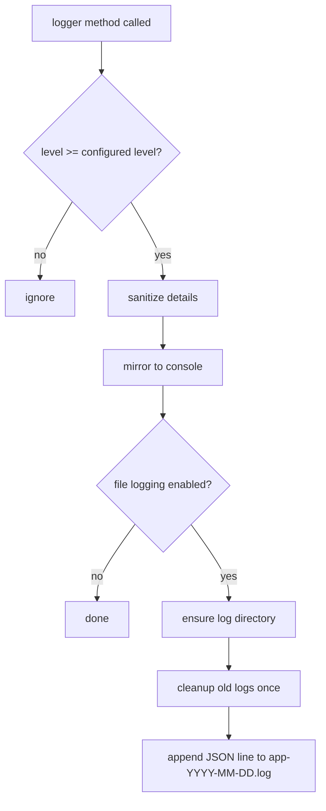
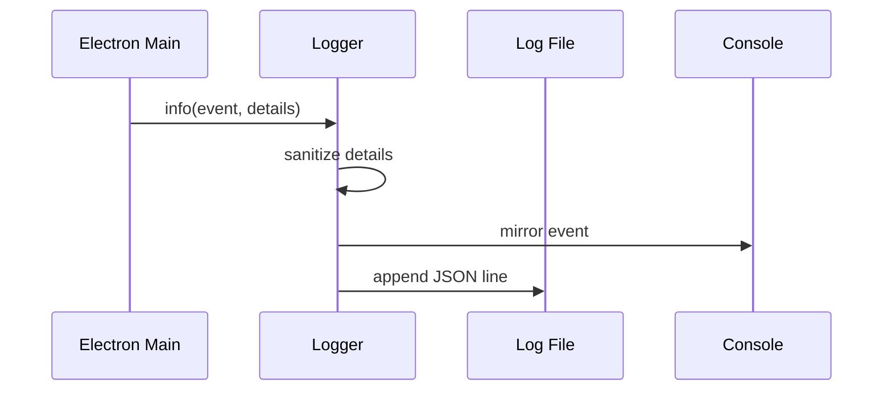

# App Logging

## 目标

App logging 提供本地 JSONL 日志，方便排查快捷键、窗口模式、权限、ChatGPT transcribe request、overlay 状态、提示音和 transcript pipeline。日志默认写到：

```text
.runtime/dandelion-electron/logs/app-YYYY-MM-DD.log
```

文件名按本地日期切分；每条日志里的 `ts` 字段保持 ISO UTC 时间。

默认日志级别是 `info`。默认隐私策略是不记录 transcript 原文，只记录文本长度、来源和状态。

相关文件：

- [`../../src/main/appLogger.js`](../../src/main/appLogger.js)
- [`../../src/main/main.js`](../../src/main/main.js)
- [`../../config/dandelion.json`](../../config/dandelion.json)

## Public API

### `createAppLogger(options)`

创建 JSONL logger。

参数：

- `logDir`：日志目录。
- `enabled`：是否写入本地文件，默认 `true`。
- `level`：最低日志级别，支持 `debug`、`info`、`warn`、`error`。
- `retentionDays`：日志保留天数，默认 `7`。
- `console`：console 兼容对象，日志仍会 mirror 到启动 terminal。
- `nowFn`：当前时间函数，主要用于测试。

返回：

- `debug(event, details)` / `info(event, details)` / `warn(event, details)` / `error(event, details)`。
- `getLogDir()`：返回日志目录。

### `sanitizeLogDetails(value)`

清理日志字段。`text`、`transcript`、`body`、`cookie`、`token`、`authorization` 等字段会被 redacted；URL 只保留 `origin` 和 `pathname`。

### `cleanupOldLogs(logDir, retentionDays, now)`

删除超出保留天数的 `app-YYYY-MM-DD.log` 文件。清理失败不会阻止 app 启动或当前日志写入。

### `buildLogFilePath(logDir, date)` / `getDateStamp(date)`

按本地日期生成 `app-YYYY-MM-DD.log` 路径；日志行内部仍使用 UTC `ts`。

## Level Policy

| Level | 用途 | 典型事件 |
| --- | --- | --- |
| `debug` | 高频、正常、只有排查时才需要的细节 | permission 放行/拒绝、页面导航、overlay ready/load、内部 bridge 注册、DOM 候选文本、提示音子进程退出码 |
| `info` | 用户动作或关键状态变化 | app boot、开始/结束/取消听写、start confirmed、transcribe request observed、overlay 状态变化、transcribe started/succeeded、transcript finalized、提示音 spawn 发起 |
| `warn` | app 可以继续运行，但当前功能可能降级或需要重试 | start unconfirmed retry、missing transcribe request timeout、stop skipped、CDP monitor attach 失败、transcribe response 没有文本、提示音子进程非 0 退出 |
| `error` | 当前动作失败，需要修复配置、权限或代码 | shortcut 注册失败、ChatGPT load failed、transcribe failed、pipeline finalize failed、未捕获异常 |

## Flowchart



## Time Sequence



## 隐私边界

- 不记录 transcript 原文。
- 不记录 clipboard 内容。
- 不记录 cookie、token、authorization 或 response body。
- URL 只记录 `origin` 和 `pathname`，不记录 query string 或 hash。

## 测试覆盖

测试文件：

- [`../../tests/appLogger.test.js`](../../tests/appLogger.test.js)

覆盖内容：

- JSONL 写入。
- level filter。
- 7 天日志轮转。
- sensitive details sanitization。
- disabled file logging 时不写文件但保留 console mirror。
