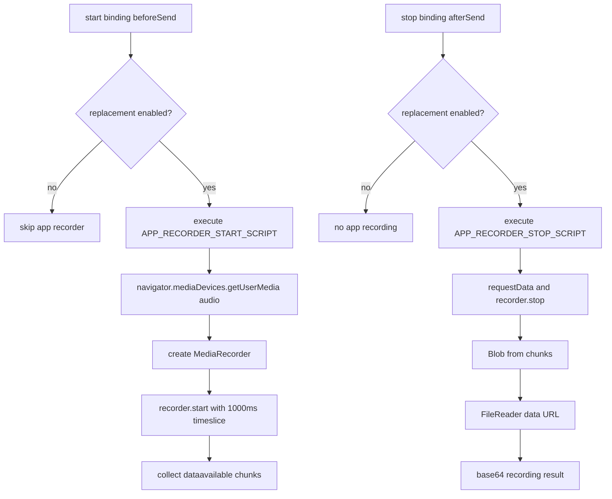
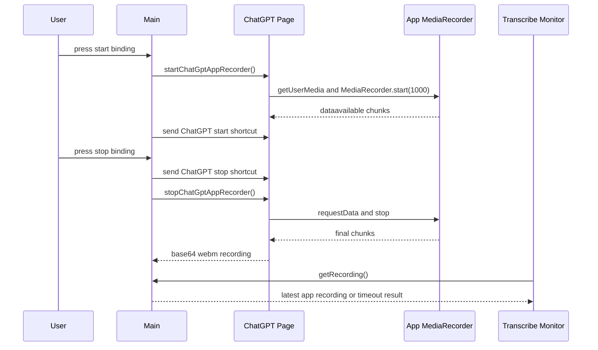

# ChatGPT App Recorder

## 目标

ChatGPT app recorder 是 app 自己控制的一条页面侧录音链路。它在 ChatGPT 页面主 world 里注入 `MediaRecorder`，独立于 ChatGPT 网页自己的 recorder。开启 `transcribe.replaceUploadWithAppRecording` 后，它负责生成一份 app 侧 `webm`，供 upload replacement 替换 `/backend-api/transcribe` request 的音频 file part。

相关文件：

- [`../../src/main/chatgptAppRecorder.js`](../../src/main/chatgptAppRecorder.js)
- [`../../src/main/main.js`](../../src/main/main.js)
- [`../../src/main/chatgptTranscribeMonitor.js`](../../src/main/chatgptTranscribeMonitor.js)

## Public API

### `startChatGptAppRecorder(options)`

在 ChatGPT `WebContents` 里执行 start script。

参数：

- `webContents`：ChatGPT 页面对应的 Electron `WebContents`。
- `logger`：可选 app logger。

返回 start summary，包含 `ok`、`id`、`mimeType`、`status`、`chunkCount`、`totalBytes` 等字段。main process 最多等待 `2000ms`；超时或失败会继续发送 start shortcut，并让后续 replacement 放行原始 request。

### `stopChatGptAppRecorder(options)`

在 ChatGPT `WebContents` 里执行 stop script，停止 app recorder，导出 base64 `webm`。

返回标准化 recording result：

- `ok`：是否拿到非空录音。
- `base64`：录音内容，用于 CDP `Fetch.continueRequest` 的 multipart body。
- `byteLength`、`chunkCount`、`durationMs`、`mimeType`：排障摘要。
- `events`：recorder 事件摘要。

### `normalizeRecordingResult(result)`

把页面脚本返回值标准化成 main process 和 upload replacement 使用的结构。

## Flowchart

## Time Sequence

## 边界

- app recorder 只在 `transcribe.replaceUploadWithAppRecording=true` 时启动。
- 它使用 ChatGPT 页面里的 browser APIs，所以仍受系统麦克风权限和 Chromium `MediaRecorder` 支持情况影响。
- start 失败、stop 失败、录音为空或等待超时都不会阻塞听写；monitor 会继续 ChatGPT 原始 request。
- `app-recording.webm` 只写入命中的 remote debug request 目录，不写入普通 JSONL log。

## 测试覆盖

测试文件：

- [`../../tests/chatgptAppRecorder.test.js`](../../tests/chatgptAppRecorder.test.js)

覆盖内容：

- start / stop script 调用。
- recording result 标准化。
- `webContents` 不可用或执行失败时返回可诊断错误。
