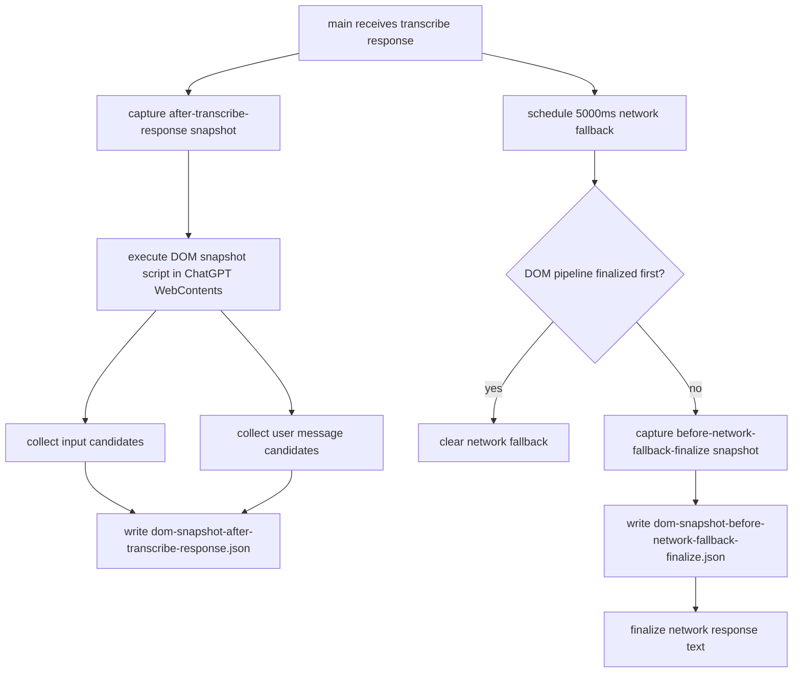
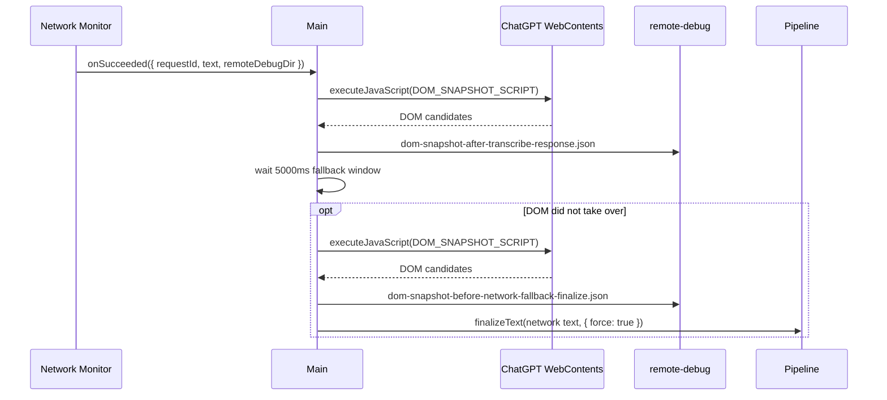

# ChatGPT DOM Snapshot

## 目标

ChatGPT DOM snapshot 是 transcribe 排障用 artifact。它不参与最终文本选择，只在 network response 之后读取页面 DOM，保存当时页面里能看到的 transcript 候选文本，回答一个具体问题：remote 已经返回后，ChatGPT 页面里到底写了什么。

核心文件：

- [`../../src/main/chatgptDomSnapshot.js`](../../src/main/chatgptDomSnapshot.js)
- [`../../src/main/main.js`](../../src/main/main.js)

artifact 写入本轮 transcribe request 的 debug 目录：

```text
remote-debug/transcribe/<timestamp>/<requestId>/
```

当前会写两类文件：

- `dom-snapshot-after-transcribe-response.json`：`/backend-api/transcribe` response 被 main process 接收后立即抓取。
- `dom-snapshot-before-network-fallback-finalize.json`：5 秒 network fallback 真正 finalize 前抓取。

## Public API

### `captureChatGptDomSnapshot(options)`

从 ChatGPT `WebContents` 抓取一次 DOM snapshot，并写入指定目录。

参数：

- `webContents`：ChatGPT 页面对应的 Electron `WebContents`。
- `outputDir`：artifact 输出目录。
- `label`：文件名 label，例如 `after-transcribe-response`。
- `requestId`：可选 transcribe request id。
- `logger`：可选 app logger。
- `nowFn`：可选当前时间函数，主要用于测试。

返回：

- 成功写入时返回 artifact 路径。
- 页面不可用、窗口已销毁或抓取失败时返回 `null`。

## Artifact 内容

snapshot 会保留原文，不走普通 app logger 的 redaction。主要字段：

- `snapshot.inputCandidates`：匹配 `#prompt-textarea`、`textarea`、`[contenteditable="true"]` 的候选元素。
- `snapshot.userMessageCandidates`：匹配最新 user message selector 的候选元素。
- `snapshot.latestInputText`：最后一个非空 input 候选文本。
- `snapshot.latestUserMessageText`：最后一个非空 user message 候选文本。
- `snapshot.selectedText`：当前选择逻辑会优先使用 input，其次使用 user message。
- 每个 candidate 会记录 `selector`、`tagName`、`id`、`role`、`ariaLabel`、`dataTestId`、`text` 和 `textLength`。

## Flowchart



## Time Sequence



## 测试覆盖

测试文件：

- [`../../tests/chatgptDomSnapshot.test.js`](../../tests/chatgptDomSnapshot.test.js)

覆盖内容：

- label path segment 清理。
- snapshot summary 统计。
- 成功写入 artifact 并保留 DOM 原文。
- `webContents` 已销毁时跳过。
- `executeJavaScript` 失败时写入 failed artifact。
