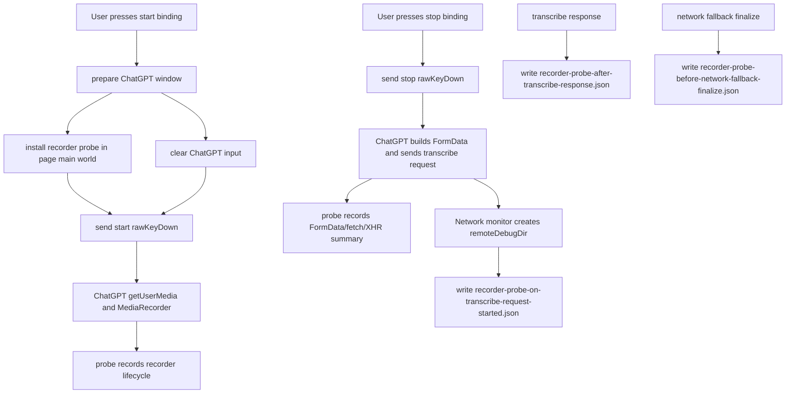
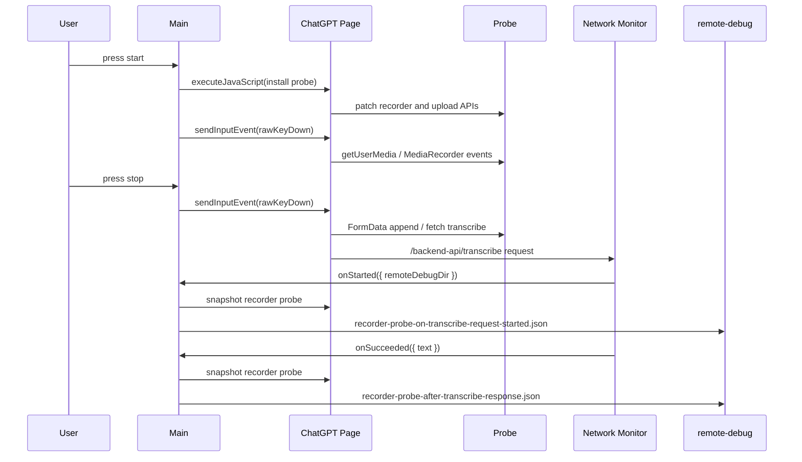

# ChatGPT Recorder Probe

## 目标

ChatGPT recorder probe 用来排查“app 记录的听写时长”和“ChatGPT 实际上传的 `whisper.webm` 时长”不一致的问题。它在开始听写快捷键发送前注入到 ChatGPT 页面主 world，记录页面自己的录音和上传链路事件。

它只做诊断，不替换请求，不改变 ChatGPT 上传的音频。

核心文件：

- [`../../src/main/chatgptRecorderProbe.js`](../../src/main/chatgptRecorderProbe.js)
- [`../../src/main/main.js`](../../src/main/main.js)

## 记录内容

probe 会 patch 页面主 world 里的这些 API：

- `navigator.mediaDevices.getUserMedia`
- `MediaRecorder`
- `FormData.prototype.append`
- `FormData.prototype.set`
- `fetch`
- `XMLHttpRequest`
- `navigator.sendBeacon`

它记录的重点是：

- ChatGPT 页面什么时候请求 microphone stream。
- `MediaRecorder` 什么时候 constructed、start、stop、pause、resume。
- `dataavailable` 事件产生了多少次、每次 blob size/type 是什么、累计字节数是多少。
- transcribe request 发出前，`FormData` 里 file/blob 的 size、type、filename。
- transcribe request 是通过 `fetch`、`XMLHttpRequest` 还是 `sendBeacon` 发出的。

## Artifact

artifact 写入本轮 transcribe request 的 debug 目录：

```text
remote-debug/transcribe/<timestamp>/<requestId>/
```

当前会写：

- `recorder-probe-on-transcribe-request-started.json`
- `recorder-probe-after-transcribe-response.json`
- `recorder-probe-before-network-fallback-finalize.json`
- `recorder-probe-after-transcribe-failed.json`
- `recorder-probe-after-transcribe-response-without-text.json`

每个文件包含：

- `snapshot.events`：按时间顺序记录的 recorder/upload 事件。
- `snapshot.recorders`：每个 recorder 的 stream tracks、mimeType、状态、`dataavailable` 计数和累计字节数。
- `snapshot.patches`：每个 API patch 是否安装成功。
- `snapshot.counters.eventsDropped`：事件超过上限后被丢弃的数量。

## Flowchart



## Time Sequence



## 边界

- probe 运行在 ChatGPT 页面主 world，所以必须在 start shortcut 前安装。
- probe 不保存音频字节。音频字节仍通过 Network `request-post-data.json` 保存。
- probe 不修改 request。它只记录页面生成的 blob/form data 摘要。
- 如果 ChatGPT 页面使用了没有被 patch 的内部上传路径，Network artifact 仍然是最终证据。

## 测试覆盖

测试文件：

- [`../../tests/chatgptRecorderProbe.test.js`](../../tests/chatgptRecorderProbe.test.js)

覆盖内容：

- 安装脚本包含 recorder/upload patch。
- 安装调用 `webContents.executeJavaScript()`。
- snapshot artifact 写入。
- snapshot summary 统计。
- `webContents` 已销毁时跳过。
- snapshot 失败时写 failed artifact。
