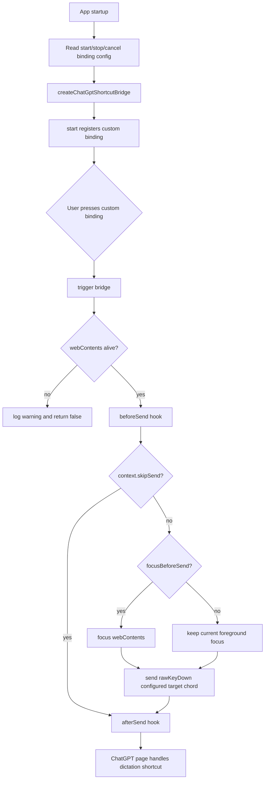
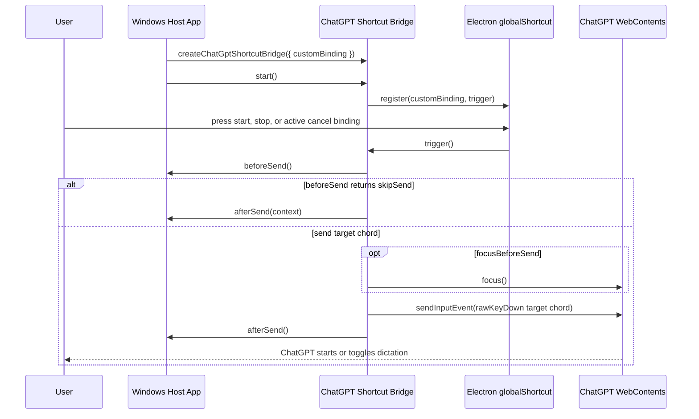

# ChatGPT Shortcut Bridge

## 目标

这个模块解决一个具体问题：ChatGPT 网页自己的听写快捷键是 `Ctrl+Shift+D`，但这个组合键可能被游戏或其他应用占用。宿主应用不要求用户按网页原始快捷键，而是监听可配置的自定义 binding，再把目标 chord 作为键盘事件发送进内嵌 ChatGPT 页面。

当前 app 层使用三个 bridge 实例：

- 开始听写：默认 `Alt+Shift+R` -> `Ctrl+Shift+D`
- 结束听写：默认 `Alt+Shift+S` -> `Ctrl+Shift+D`
- 取消听写：默认 `Escape` -> `Escape`，只在 `listening` / `processing` 状态临时注册

当前实现面向 Electron 主进程，核心文件是 [`../../src/shortcut/chatgptShortcutBridge.js`](../../src/shortcut/chatgptShortcutBridge.js)。

## Public API

### `createChatGptShortcutBridge(options)`

创建一个快捷键桥接 controller。

参数：

- `globalShortcut`：Electron `globalShortcut` 兼容对象。
- `webContents`：承载 `https://chatgpt.com` 的 Electron `WebContents`。
- `customBinding`：宿主应用监听的自定义 binding，例如 `Alt+Shift+R`、`Super+Alt+D`。
- `targetChord`：发送到网页的目标组合键，默认是 `Ctrl+Shift+D`。
- `focusBeforeSend`：发送按键前是否 focus ChatGPT 页面，默认 `false`，这样尽量保留原本前台应用的焦点。
- `beforeSend`：发送网页快捷键前调用，app 用它保存当前 Windows 前台窗口并临时显示 ChatGPT。返回对象可以带 `readyToSend` promise 和 `dispatchDelayMs`，用于等待窗口激活、输入框清空等异步准备完成后再发送网页快捷键。返回对象设置 `skipSend: true` 时，bridge 不会向网页发送目标 chord，但仍会调用 `afterSend(context)`，让 app 记录 skip 原因或恢复本地状态。
- `afterSend`：发送网页快捷键后调用，app 用它恢复之前的前台窗口。
- `logger`：可选日志对象。

返回值：

- `start()`：注册宿主自定义 binding。
- `stop()`：注销宿主自定义 binding。
- `trigger()`：立即向网页发送目标组合键。
- `isRegistered()`：返回当前注册状态。

### `normalizeElectronAccelerator(binding)`

把用户配置的 binding 标准化成 Electron accelerator 格式，例如把 `ctrl + shift + r` 转成 `Control+Shift+R`。

### `normalizeWebChord(chord)`

把网页目标组合键标准化成 `webContents.sendInputEvent` 所需格式，例如把 `Ctrl+Shift+D` 转成：

```js
{
  keyCode: 'D',
  modifiers: ['control', 'shift']
}
```

### `buildWebKeyEvents(chord)`

生成发送给 `webContents.sendInputEvent` 的一个 `rawKeyDown` 事件。当前不发送 `keyUp`，因为 ChatGPT 听写入口只需要快捷键按下阶段；少发释放阶段可以避免页面把 stop 的 key release 解释成额外输入。

## Flowchart



## Time Sequence



## 使用方式

```js
const { globalShortcut } = require('electron');
const {
  createChatGptShortcutBridge
} = require('./src/shortcut/chatgptShortcutBridge');

const bridge = createChatGptShortcutBridge({
  customBinding: 'Alt+Shift+R',
  globalShortcut,
  webContents: chatGptBrowserWindow.webContents
});

bridge.start();
```

应用退出时调用：

```js
bridge.stop();
```

## Windows 约束

- 这个模块不会让游戏收到网页目标 chord；它只把目标 chord 发送到内嵌 ChatGPT 页面。取消 binding 为 `Escape` 时，只会在听写活跃期间被 Electron 捕获。
- 如果游戏以管理员权限运行，而本应用不是管理员权限，Windows 可能不允许本应用收到全局快捷键。
- 如果游戏使用独占输入或屏蔽系统快捷键，Electron `globalShortcut` 也可能收不到 binding。此时需要换一个不被游戏占用的 binding，或者让本应用和游戏运行在相同权限级别。
- 若以后切换到 WebView2，可以用 `CoreWebView2.CallDevToolsProtocolMethodAsync("Input.dispatchKeyEvent", ...)` 做同类注入。普通 JavaScript `dispatchEvent(new KeyboardEvent(...))` 可能因为事件不是 trusted event 而无法触发网页内部快捷键逻辑。

## 测试

当前测试位于 [`../../tests/chatgptShortcutBridge.test.js`](../../tests/chatgptShortcutBridge.test.js)，覆盖：

- 用户 binding 标准化。
- 目标网页组合键标准化。
- `rawKeyDown` 事件生成。
- `Escape` binding 和网页 `Escape` 事件生成。
- 自定义 binding 触发后发送 `Ctrl+Shift+D` 到网页。
- 默认不 focus 网页，按需可启用 `focusBeforeSend`。
- `beforeSend` / `afterSend` 会包住网页快捷键发送过程。
- 重复启动不会重复注册。
- `start()` 被解构后调用仍然能正确注册。
- `stop()` 会注销 binding。
- 注册失败和 `webContents` 已销毁时的异常路径。

运行：

```bash
node tests/chatgptShortcutBridge.test.js
```
