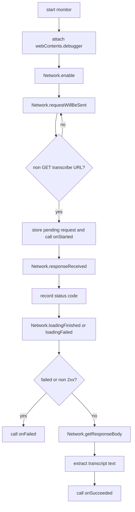
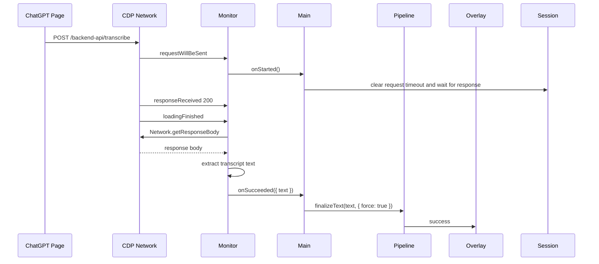

# ChatGPT Transcribe Monitor

## 目标

ChatGPT transcribe monitor 用 Electron `webContents.debugger` 接入 Chrome DevTools Protocol Network domain，监听 ChatGPT 页面实际发出的 transcribe request。它的职责是：

- 发现 `/backend-api/transcribe` 或 `/transcribe` 这类非 GET request。
- 在 2xx response 完成后读取 response body。
- 从 body 中提取 `text`、`transcript` 或 `transcription` 字段。
- 把最终文本交给 transcript pipeline 立即复制、保存和粘贴。

这样 stop 后的 “处理中” 状态不只依赖 DOM 观察器。DOM selector 漏掉更新、文本已经提前进入输入框、或页面重载后仍然可以用 network response 完成本轮听写。

相关文件：

- [`../../src/main/chatgptTranscribeMonitor.js`](../../src/main/chatgptTranscribeMonitor.js)
- [`../../src/main/main.js`](../../src/main/main.js)
- [`../../src/main/transcriptPipeline.js`](../../src/main/transcriptPipeline.js)

## Public API

### `createChatGptTranscribeMonitor(options)`

创建 monitor controller。

参数：

- `webContents`：ChatGPT `BrowserWindow.webContents`。
- `onStarted(payload)`：发现 transcribe request 时触发。
- `onSucceeded(payload)`：2xx response 完成并读取 body 后触发，`payload.text` 是解析出的 transcript。
- `onFailed(payload)`：request 失败或返回非 2xx 时触发。
- `logger`：可选 logger。

返回：

- `start()`：attach CDP debugger，启用 Network domain，并开始监听。
- `stop()`：移除监听器并清空 pending request。
- `isStarted()`：返回当前监听状态。

### `isLikelyTranscribeRequest(url, method)`

判断 request 是否是非 GET 的 ChatGPT transcribe request。

### `extractTranscriptTextFromResponseBody(body, base64Encoded)`

处理 CDP 返回的 response body，支持 base64 解码和 JSON 解析。

### `recursiveFindTranscriptText(value)`

从未知 JSON 结构中递归查找 `text`、`transcript`、`transcription` 字段。

## Flowchart

## Time Sequence

## 边界

- `webContents.debugger` 同一时间可能被 DevTools 或其他 debugger 占用；attach 失败时 app 会记录 warning，并退回 DOM transcript pipeline。
- `session.webRequest` 只能稳定拿到请求和 status，不能直接读取 response body，所以这里使用 CDP Network。
- response body shape 属于 ChatGPT 网页内部实现，仍可能变化；monitor 已使用宽松字段递归，但无法保证永久兼容。
- 取消听写后 main process 会关闭本轮 transcript 接收；即使 transcribe response 后续返回，也不会复制、粘贴或保存。

## 测试覆盖

测试文件：

- [`../../tests/chatgptTranscribeMonitor.test.js`](../../tests/chatgptTranscribeMonitor.test.js)

覆盖内容：

- transcribe request 匹配。
- JSON 和 base64 response body 文本提取。
- 避免把 `status` 这类普通字符串字段误识别为 transcript。
- CDP request/response/loadingFinished 成功路径。
- 非 2xx response 的失败路径。
