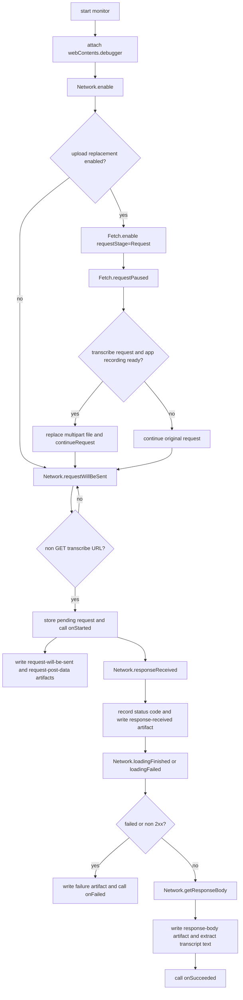
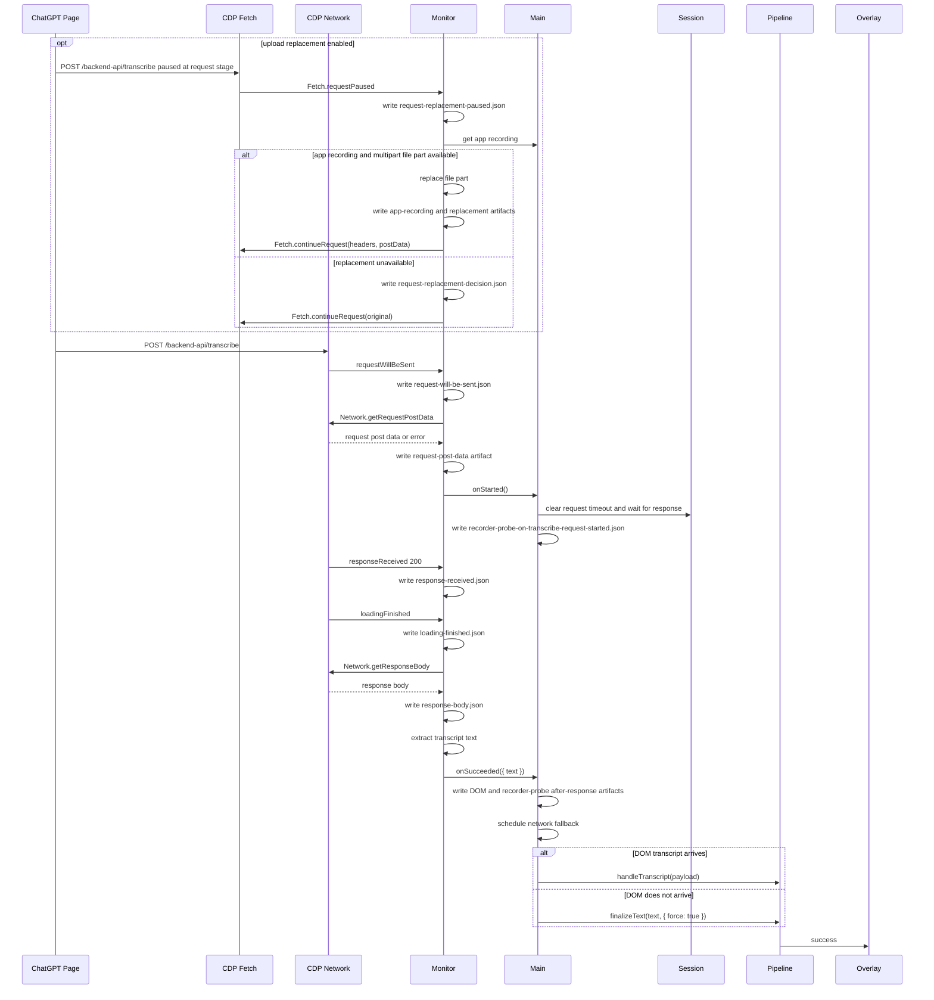

# ChatGPT Transcribe Monitor

## 目标

ChatGPT transcribe monitor 用 Electron `webContents.debugger` 接入 Chrome DevTools Protocol Network domain，监听 ChatGPT 页面实际发出的 transcribe request。开启 upload replacement 时，它也会启用 CDP Fetch domain，在 request 发出前替换 multipart body 里的音频 file part。它的职责是：

- 发现 `/backend-api/transcribe` 或 `/transcribe` 这类非 GET request。
- 在 2xx response 完成后读取 response body。
- 从 body 中提取 `text`、`transcript` 或 `transcription` 字段。
- 可选：在 `Fetch.requestPaused` 阶段等待 app 侧录音，并替换 request 的 `file` part。
- 把 request/response 的 raw CDP 细节写入 remote debug artifact。
- 把 network transcript 交给 main process 作为延迟兜底候选。

这样 stop 后的 “处理中” 状态不只依赖 DOM 观察器。DOM selector 漏掉更新、文本已经提前进入输入框、或页面重载后仍然可以用 network response 兜底完成本轮听写。main process 会先给 DOM 稳定窗口机会，避免 network response 先返回截断文本时过早保存。

相关文件：

- [`../../src/main/chatgptTranscribeMonitor.js`](../../src/main/chatgptTranscribeMonitor.js)
- [`../../src/main/chatgptUploadReplacement.js`](../../src/main/chatgptUploadReplacement.js)
- [`../../src/main/main.js`](../../src/main/main.js)
- [`../../src/main/transcriptPipeline.js`](../../src/main/transcriptPipeline.js)

## Public API

### `createChatGptTranscribeMonitor(options)`

创建 monitor controller。

参数：

- `webContents`：ChatGPT `BrowserWindow.webContents`。
- `onStarted(payload)`：发现 transcribe request 时触发。
- `onSucceeded(payload)`：2xx response 完成并读取 body 后触发，`payload.text` 是解析出的 transcript。
- `onFailed(payload)`：request 失败或返回非 2xx 时触发。
- `logger`：可选 logger。
- `remoteDebugLogDir`：可选 raw remote artifact 根目录；启用后不做 redaction。
- `uploadReplacement`：可选替换配置。`enabled=true` 且提供 `getRecording()` 时，monitor 会启用 CDP Fetch，pause transcribe request，并尝试用 app recording 替换上传音频。

返回：

- `start()`：attach CDP debugger，启用 Network domain，并开始监听。
- `stop()`：移除监听器并清空 pending request。
- `isStarted()`：返回当前监听状态。

### `isLikelyTranscribeRequest(url, method)`

判断 request 是否是非 GET 的 ChatGPT transcribe request。

### `extractTranscriptTextFromResponseBody(body, base64Encoded)`

处理 CDP 返回的 response body，支持 base64 解码和 JSON 解析。

### `recursiveFindTranscriptText(value)`

从未知 JSON 结构中递归查找 `text`、`transcript`、`transcription` 字段。

## Flowchart



## Remote Debug Artifacts

Packaged app 默认把 raw remote 细节写到：

```text
%APPDATA%\Dandelion\remote-debug\transcribe\<timestamp>\<requestId>\
```

开发模式对应：

```text
.runtime/dandelion-electron/remote-debug/transcribe/<timestamp>/<requestId>/
```

每条 transcribe request 会尽量保存这些文件：

- `request-will-be-sent.json`：完整 `Network.requestWillBeSent` params，包括 CDP 暴露的 request headers、URL、method、postData 等。
- `request-post-data.json`：`Network.getRequestPostData` 返回值；如果 CDP 拿不到，会写 `request-post-data-unavailable.json`。
- `request-replacement-paused.json`：`Fetch.requestPaused` 原始 params，只在 Fetch 替换链路命中时写入。
- `request-replacement-decision.json`：本次是否替换、原因、app recording 摘要和 bytes delta。
- `request-replacement-new-summary.json`：替换后的 multipart body 摘要，不保存完整新 body。
- `app-recording.webm`：app recorder 导出的实际替换音频。
- `app-recording-summary.json`：app recording 的 mime type、bytes、duration、chunk count 等摘要。
- `response-received.json`：完整 `Network.responseReceived` params，包括 response headers、status、mimeType 等。
- `loading-finished.json` / `loading-failed.json`：加载完成或失败事件。
- `response-body.json`：`Network.getResponseBody` 原始返回值，包括 `body`、`base64Encoded`，以及 monitor 解析出的 `transcript.text` 和 `textLength`。
- `response-body-read-failed.json`：读取 response body 失败时的错误对象。
- `dom-snapshot-*.json`：response 后或 fallback 前页面 input/user-message DOM 候选文本。
- `recorder-probe-*.json`：页面侧 `getUserMedia`、`MediaRecorder`、`FormData`、`fetch` / `XMLHttpRequest` 事件摘要。

这些 artifact 是为了排查 remote 和页面行为，默认保留原始 header、body、postData、transcript 文本、DOM 候选文本、recorder/upload 摘要、app recording 和 replacement decision，不走 `appLogger` 的敏感字段 redaction。普通 app JSONL 只记录 `remoteDebugDir`、`textLength`、status 等摘要，方便跳到对应目录。

## Time Sequence



## 边界

- `webContents.debugger` 同一时间可能被 DevTools 或其他 debugger 占用；attach 失败时 app 会记录 warning，并退回 DOM transcript pipeline。
- `session.webRequest` 只能稳定拿到请求和 status，不能直接读取 response body，所以这里使用 CDP Network。
- `session.webRequest` 的 `onBeforeRequest` 不能原地替换 POST body；upload replacement 使用 CDP Fetch `continueRequest` 覆盖 `postData`。
- replacement 只替换 multipart `name="file"` part；其他 form fields 保留，`content-length` 会从覆盖 headers 中去掉。
- response body shape 属于 ChatGPT 网页内部实现，仍可能变化；monitor 已使用宽松字段递归，但无法保证永久兼容。
- 取消听写后 main process 会关闭本轮 transcript 接收；即使 transcribe response 后续返回，也不会复制、粘贴或保存。

## 测试覆盖

测试文件：

- [`../../tests/chatgptTranscribeMonitor.test.js`](../../tests/chatgptTranscribeMonitor.test.js)

覆盖内容：

- transcribe request 匹配。
- JSON 和 base64 response body 文本提取。
- 避免把 `status` 这类普通字符串字段误识别为 transcript。
- CDP request/response/loadingFinished 成功路径。
- 非 2xx response 的失败路径。
- Fetch request pause 后用 app recording 替换 multipart file part，并把 replacement artifact 写入同一个 remote debug 目录。
