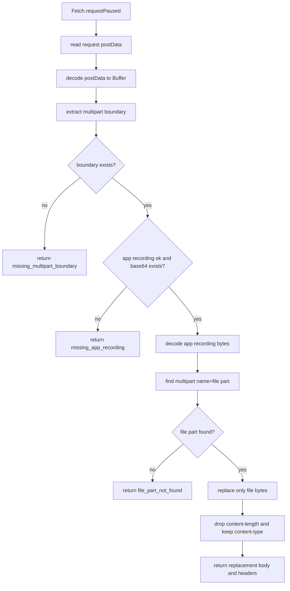
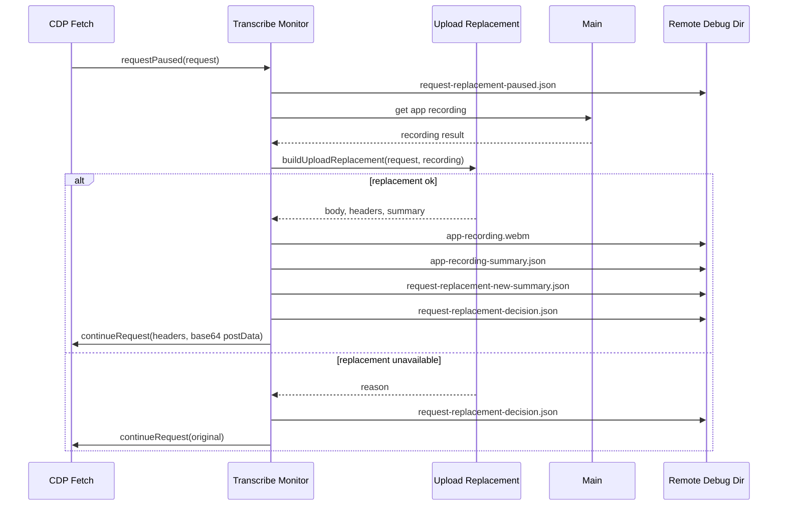

# ChatGPT Upload Replacement

## 目标

ChatGPT upload replacement 负责把 ChatGPT transcribe multipart request 里的音频 file part 换成 app recorder 生成的 `webm`。它只做 body 重写，不负责启动录音，也不负责解析 transcribe response。

相关文件：

- [`../../src/main/chatgptUploadReplacement.js`](../../src/main/chatgptUploadReplacement.js)
- [`../../src/main/chatgptTranscribeMonitor.js`](../../src/main/chatgptTranscribeMonitor.js)
- [`../../src/main/chatgptAppRecorder.js`](../../src/main/chatgptAppRecorder.js)

## Public API

### `buildUploadReplacement(request, recording)`

用 app recording 替换 CDP Fetch paused request 中 multipart body 的 `name="file"` part。

输入：

- `request`：`Fetch.requestPaused` 里的 request object，包含 `headers` 和 `postData`。
- `recording`：`stopChatGptAppRecorder()` 返回的 app recording result。

返回：

- `ok=true` 时包含 `body`、`headers`、`contentType`、`recording`、`summary`。
- `ok=false` 时包含 `reason`，例如 `missing_original_post_data`、`missing_multipart_boundary`、`missing_app_recording`、`file_part_not_found`。

### `decodePostData(postData)`

把 CDP request post data 转成 `Buffer`。当前支持 base64 和已经是 multipart 文本的情况。

### `extractBoundary(contentType, body)`

优先从 `content-type` 读取 multipart boundary；如果 header 缺失，再从 body 第一行推断。

### `findFilePart(body, boundary)`

扫描 multipart body，找到 `Content-Disposition: form-data` 且 `name="file"` 的 part，返回该 part 的 data 起止位置。

### `headersObjectToEntries(headers, contentType)`

把 request headers object 转成 CDP `Fetch.continueRequest` 需要的 header entries。它会去掉 `content-length` 和 pseudo headers，并保留或补齐 `content-type`。

## Flowchart

## Time Sequence

## Remote Debug Artifacts

替换链路命中 transcribe request 时，monitor 会在同一个 request 目录写：

- `request-replacement-paused.json`
- `request-replacement-decision.json`
- `request-replacement-new-summary.json`
- `app-recording.webm`
- `app-recording-summary.json`

这些 artifact 用来回答三个问题：

- ChatGPT 原始 request 有没有被 Fetch pause。
- app recording 是否可用，字节数和时长是多少。
- 原始 file bytes 和替换 file bytes 差多少。

## 边界

- 只替换 multipart `name="file"` 的内容，不改其他 form fields。
- 如果 multipart shape 变化或缺少 file part，会放行原始 request。
- CDP `Fetch.continueRequest` 的 `postData` 使用 base64 string。
- 这个模块不重新计算 `content-length`；它从覆盖 headers 中移除该字段，让 Chromium 处理最终长度。

## 测试覆盖

测试文件：

- [`../../tests/chatgptUploadReplacement.test.js`](../../tests/chatgptUploadReplacement.test.js)
- [`../../tests/chatgptTranscribeMonitor.test.js`](../../tests/chatgptTranscribeMonitor.test.js)

覆盖内容：

- boundary 提取。
- multipart file part 定位。
- 替换 file bytes 并保留其他 fields。
- 去掉 `content-length`。
- replacement 失败原因。
- Fetch pause 后替换 body 并写入同一个 remote debug 目录。
