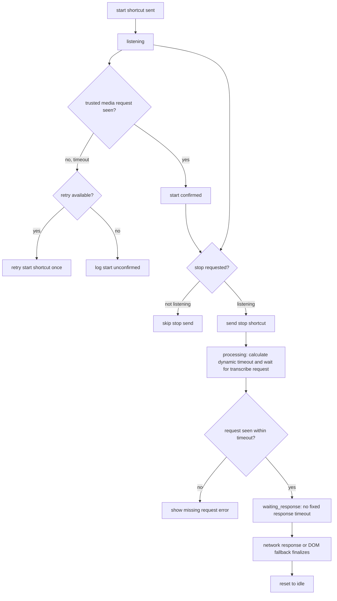
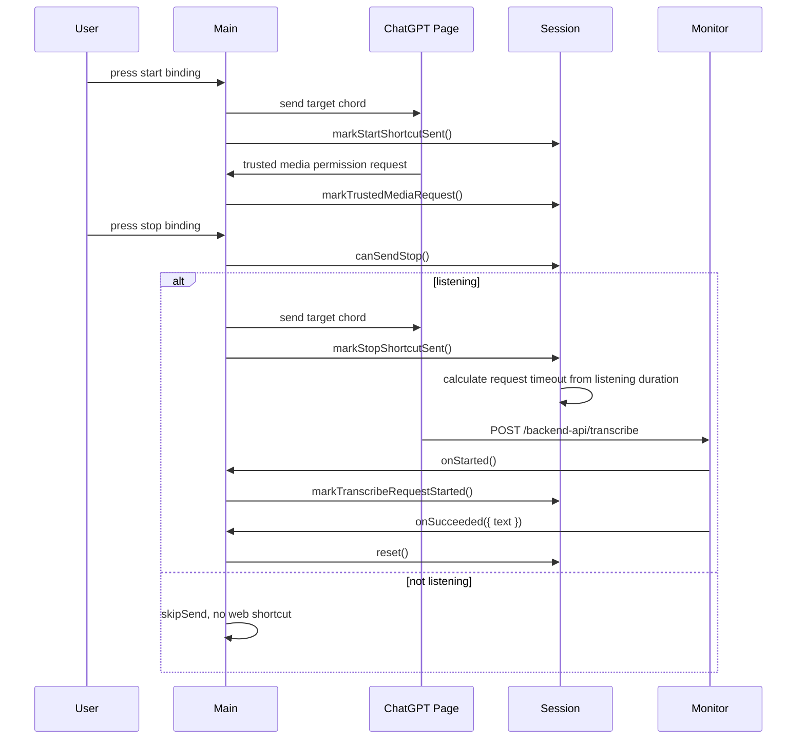

# Dictation Session

[`../../src/main/dictationSession.js`](../../src/main/dictationSession.js) 管理一轮网页听写的状态。它不直接操作 Electron window，也不读取 transcript 文本；它只回答三个问题：

- start 快捷键发出后，网页端有没有尝试打开麦克风。
- stop 快捷键是否应该发送。
- stop 后有没有看到 ChatGPT 的 transcribe request。

## Public Methods

### `createDictationSession(options)`

创建 session controller。主要 options：

- `retryStart(payload)`：start 后没有看到 ChatGPT media request 时调用，用于重试开始快捷键。
- `onMissingTranscribeRequest(snapshot)`：stop 后在 request timeout 内没有看到 transcribe request 时调用。
- `startConfirmationMs`：等待 ChatGPT media request 的时长，默认 `1500`。
- `transcribeRequestTimeoutMs`：stop 后等待 transcribe request 的基础时长，默认 `15000`。
- `maxStartRetries`：start 未确认时最多自动重试次数，默认 `1`。

实际 request timeout 会按本轮听写时长动态计算：

```text
timeout = baseTimeout + listeningDuration
```

默认配置下，短听写仍接近 `15s`；听写 `30s` 时 timeout 是 `45s`，听写 `61s` 时 timeout 约 `76.0s`，听写 `86s` 时 timeout 约 `100.6s`，听写 `113s` 时 timeout 约 `128.1s`。这个 timeout 仍然只判断“有没有看到 transcribe request”，不是 response timeout。

### `markStartShortcutSent()`

标记 start 快捷键已经发送到 ChatGPT 页面，session 进入 `listening`，并开始等待 ChatGPT 的 trusted `media` permission request。

### `markTrustedMediaRequest()`

标记 ChatGPT 页面已经请求麦克风权限。这是当前最明确的“网页端收到了 start 并开始尝试录音”的本地可观测信号。它会清理 start confirmation timer。

### `canSendStop()`

只有 session 处于 `listening` 时返回 `true`。main process 用它阻止 idle 状态下的 stop 快捷键进入网页，避免 `Ctrl+Shift+D` toggle 反向启动听写。

### `markStopShortcutSent()`

标记 stop 快捷键已经发送到 ChatGPT 页面，session 进入 `processing`，根据本轮听写时长计算 request timeout，并开始等待 transcribe request。这个 timeout 只用于判断“有没有 request”，不是 response timeout。

### `markTranscribeRequestStarted(payload)`

标记已经看到 ChatGPT 的 transcribe request。调用后会清理 request timeout，并进入 `waiting_response`。从这里开始不再用固定 15 秒限制 response。

在日志语义上，`transcribe.succeeded` 表示 network monitor 已经拿到 ChatGPT 的 transcribe response 并解析出文本；`transcript.finalized` 表示某个 DOM 或 network fallback 候选已经经过本地 transcript pipeline，写入剪贴板、保存到 `last-transcript.json`，并在开启自动粘贴时发出粘贴。当前 session snapshot 里还会带上 `observedTranscribeRequestId`，main process 用它保证只有“stop 后观察到的那条 request”的 response 才能成为 fallback 候选，避免 timeout 后的迟到旧结果串进新 session。

### `reset()` / `cancel()`

清理所有 timer 并回到 `idle`。`cancel()` 会额外写 `dictation.session.cancelled` 日志。

## Flowchart



## Time Sequence


