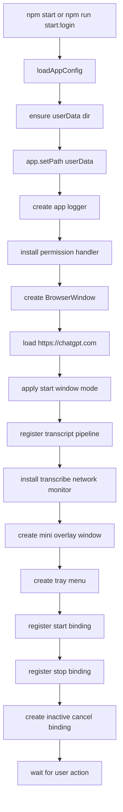
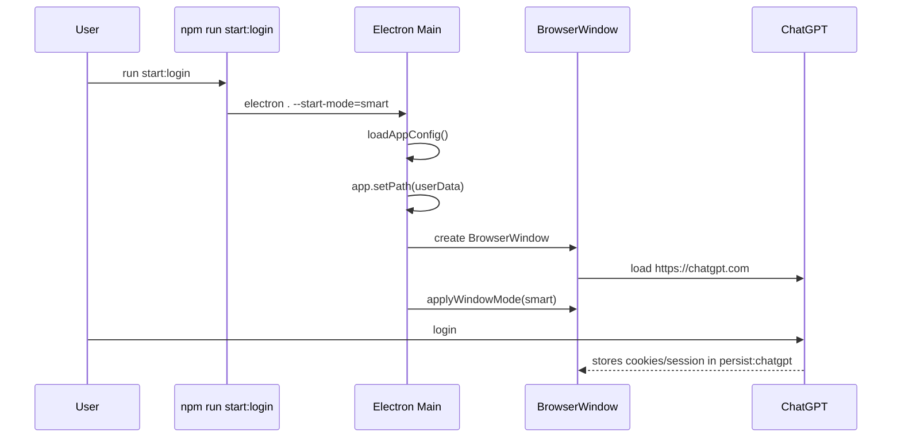
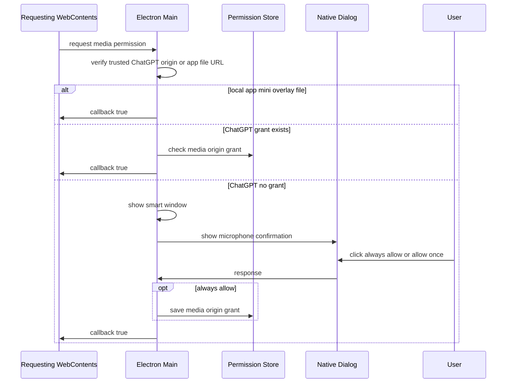
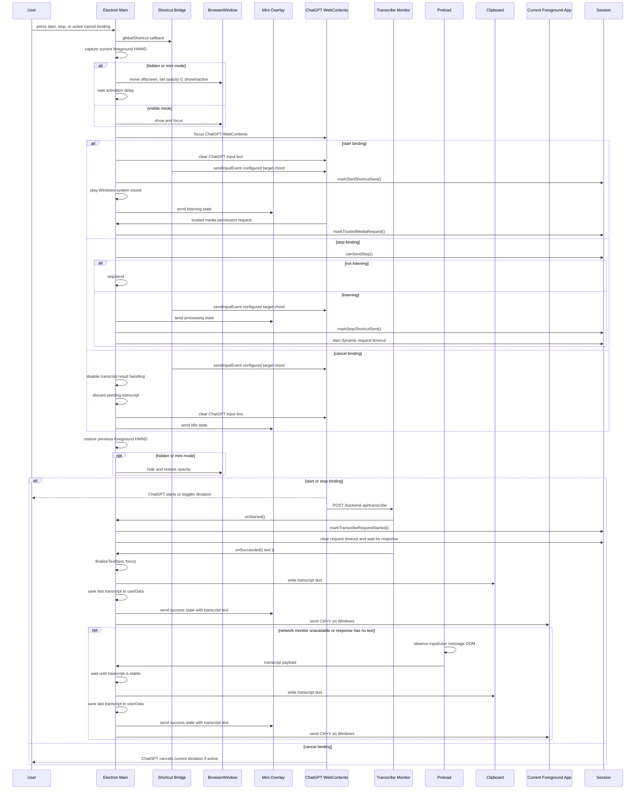

# Electron App Runtime

## 目标

这个 runtime 把仓库从纯模块推进到可运行桌面 app。用户可以启动 Electron，打开内嵌 `https://chatgpt.com`，手动登录账号，登录态会保存在本地 userData 目录里；之后通过自定义 binding 触发 ChatGPT 网页中的 `Ctrl+Shift+D` 听写行为。

入口文件：

- [`../../package.json`](../../package.json)
- [`../../src/main/main.js`](../../src/main/main.js)
- [`../../src/main/appIcon.js`](../../src/main/appIcon.js)
- [`../../src/main/appConfig.js`](../../src/main/appConfig.js)
- [`../../src/main/appLogger.js`](../../src/main/appLogger.js)
- [`../../src/main/miniOverlayWindow.js`](../../src/main/miniOverlayWindow.js)
- [`../../src/main/windowModes.js`](../../src/main/windowModes.js)
- [`../../src/main/permissions.js`](../../src/main/permissions.js)
- [`../../src/main/chatgptTranscribeMonitor.js`](../../src/main/chatgptTranscribeMonitor.js)
- [`../../src/preload/chatgptPreload.js`](../../src/preload/chatgptPreload.js)
- [`../../src/preload/miniOverlayPreload.js`](../../src/preload/miniOverlayPreload.js)
- [`../../src/renderer/miniOverlay.html`](../../src/renderer/miniOverlay.html)

## 运行命令

安装依赖：

```bash
npm install
```

验证 Electron 主入口能启动：

```bash
npm run smoke
```

第一次登录或需要授权麦克风时：

```bash
npm run start:login
```

默认最小化声波模式启动：

```bash
npm start
```

测试：

```bash
npm test
```

## 配置

默认配置文件是 [`../../config/dandelion.json`](../../config/dandelion.json)。普通配置优先级是：环境变量 > 配置文件 > 默认值。CLI 参数用于指定 config 文件、启动模式、smoke test 等运行选项。

配置文件示例：

```json
{
  "bindings": {
    "start": "F1",
    "stop": "F2",
    "cancel": "Escape"
  },
  "targetChords": {
    "start": "Ctrl+Shift+D",
    "stop": "Ctrl+Shift+D",
    "cancel": "Escape"
  },
  "logging": {
    "enabled": true,
    "level": "info",
    "retentionDays": 7
  },
  "autoPasteTranscript": true,
  "transcriptStableMs": 2500,
  "startMode": "mini"
}
```

`F1`、`F2`、`Ctrl+F1` 这类 function key accelerator 可以配置。`Fn` 通常由键盘固件处理，不会作为普通按键事件到达 Windows，所以不能配置 `Fn` 或 `Fn+F1`；如果键盘需要按 `Fn+F1` 才发送 `F1`，配置里写 `F1`。

逗号和句号键建议写成 `Alt+,` 和 `Alt+.`。为了减少配置错误，app 也会把 `Alt+Comma` / `Alt+Period` 自动标准化成 `Alt+,` / `Alt+.`。

| 配置 | 默认值 | 说明 |
|------|--------|------|
| `DANDELION_AUTO_PASTE` | `true` | transcript 完成后是否自动粘贴到前台窗口；设为 `false` 时只复制到剪贴板 |
| `DANDELION_CHATGPT_URL` | `https://chatgpt.com` | 内嵌页面地址 |
| `DANDELION_START_BINDING` | `Alt+Shift+R` | 开始听写宿主快捷键 |
| `DANDELION_STOP_BINDING` | `Alt+Shift+S` | 结束听写宿主快捷键 |
| `DANDELION_CANCEL_BINDING` | `Escape` | 取消听写宿主快捷键，只在听写活跃时临时注册 |
| `DANDELION_START_TARGET_CHORD` | `Ctrl+Shift+D` | 开始听写时发送给 ChatGPT 页面的目标快捷键 |
| `DANDELION_STOP_TARGET_CHORD` | `Ctrl+Shift+D` | 结束听写时发送给 ChatGPT 页面的目标快捷键 |
| `DANDELION_CANCEL_TARGET_CHORD` | `Escape` | 取消听写时发送给 ChatGPT 页面的目标快捷键 |
| `DANDELION_CUSTOM_BINDING` | 无 | 旧配置名，作为开始听写 binding fallback |
| `DANDELION_LOG_ENABLED` | `true` | 是否写入本地 log |
| `DANDELION_LOG_LEVEL` | `info` | 本地 log 级别；需要排查 permission、窗口和 bridge 细节时改成 `debug` |
| `DANDELION_LOG_RETENTION_DAYS` | `7` | 本地 log 保留天数 |
| `DANDELION_TARGET_CHORD` | 无 | 旧配置名，作为开始/结束 target chord fallback |
| `DANDELION_SESSION_PARTITION` | `persist:chatgpt` | Electron 持久 session partition |
| `DANDELION_START_MODE` | `mini` | 默认窗口模式 |
| `DANDELION_TRANSCRIPT_STABLE_MS` | `2500` | transcript 稳定多久后视为听写完成 |
| `DANDELION_USER_DATA_DIR` | `.runtime/dandelion-electron` | Electron userData 目录 |

旧的 `GENERAL_STT_*` 环境变量仍作为 fallback 保留；新配置和文档使用 `DANDELION_*`。

开发模式默认从仓库根目录读取 `config/dandelion.json`，并把 userData 写到 `.runtime/dandelion-electron`。packaged app 默认从 `resources/config/dandelion.json` 读取配置，并把 userData 写到 `%APPDATA%\Dandelion`。

CLI：

- `--config=...`：指定配置文件路径。
- `--start-mode=smart`：启动时显示登录/授权窗口。
- `--chatgpt-url=...`：覆盖加载 URL，主要用于 smoke test。
- `--smoke-test`：页面加载完成后自动退出。
- `--disable-shortcuts`：跳过全局快捷键注册，主要用于非 Windows smoke test。

## 启动 Flowchart



## 登录 Time Sequence



## 麦克风授权 Time Sequence



## 快捷键 Time Sequence



## 窗口模式

`applyWindowMode` 支持：

- `hidden`：窗口隐藏并从 taskbar 移除。快捷键触发时会临时透明激活，发送完成后恢复隐藏，避免窗口在游戏或其他前台应用上闪现。
- `mini`：ChatGPT 主窗口隐藏，右下角显示不可 focus 的 always-on-top 声波 overlay。点击 overlay 或 tray 可回到 `smart` 窗口。
- `tiny`：右下角极小窗口。
- `smart`：居中显示登录/授权窗口。
- `corner`：右下角可见窗口。

托盘菜单可以在这些模式之间切换。托盘点击默认进入 `smart` 模式，便于登录或处理麦克风授权。关闭主 ChatGPT 窗口会回到 `mini` 模式。

## Icon

窗口图标和 Windows 右下角 tray 图标都使用 [`../../assets/logo.png`](../../assets/logo.png)。主进程通过 [`../../src/main/appIcon.js`](../../src/main/appIcon.js) 解析和创建 Electron `nativeImage`。

## Log

本地 log 默认写到：

```text
.runtime/dandelion-electron/logs/app-YYYY-MM-DD.log
```

格式是 JSON Lines。每行包含 `ts`、`level`、`event` 和可选 `details`。日志会 mirror 到启动 terminal，也会写入文件。默认级别是 `info`，常规 permission 请求、页面导航和内部 bridge 细节都在 `debug`。日志默认保留 7 天，app 启动后会 best-effort 清理过期文件。托盘菜单提供“打开日志目录”。

隐私策略：

- 不记录 transcript 原文，只记录 `textLength`。
- 不记录 clipboard 内容、cookie、token、authorization 或 response body。
- URL 只记录 `origin` 和 `pathname`。

## 当前边界

- ChatGPT 登录必须由用户手动完成。
- 本地 log 默认开启，写入 `userData/logs`。如果需要关闭，设置 `DANDELION_LOG_ENABLED=false` 或在配置文件中设置 `logging.enabled=false`。
- 麦克风权限会显示原生确认框，用户可以选“始终允许”“仅本次允许”或“拒绝”。“始终允许”会保存到 `permissions.json`，后续同一 ChatGPT origin 的 `media` 请求会直接放行。
- mini overlay 只有在 `mini` 模式可见且状态为 `listening` 时，才通过本地 `file://` UI 读取麦克风电平来显示声波；待机、处理中、成功、失败和其他窗口模式都会停止本地 mic tracks。这个本地 UI 位于 app root 内，由 permission handler 自动放行；如果系统层面拒绝麦克风，overlay 会退回到非真实音量的 fallback 动画。overlay 支持拖动到任意屏幕，位置保存到 `userData/mini-overlay-placement.json`，屏幕布局变化后会 clamp 到最近可用 display。
- ChatGPT transcribe monitor 使用 `webContents.debugger` 监听网页实际 transcribe request，并读取 response body 作为优先完成信号；如果 debugger 被 DevTools 或其他工具占用，会记录 warning 并退回 DOM 观察器。
- transcript DOM 观察器是 network monitor 不可用或 response body 无文本时的 fallback。它依赖 ChatGPT 当前网页结构，已使用宽松 selector，但网页改版后仍可能需要更新。
- Windows 粘贴使用 PowerShell `System.Windows.Forms.SendKeys` 发出 `Ctrl+V`。如果目标应用或游戏使用管理员权限、独占输入或屏蔽模拟按键，可能需要让本 app 以相同权限运行。
- 为了让 ChatGPT 页面收到网页快捷键，app 会在触发时 focus 内嵌 `WebContents`，然后通过 Win32 `SetForegroundWindow` 尝试恢复之前的前台窗口。`hidden` 和 `mini` 模式下窗口会先移到屏幕外、设为完全透明并使用 `showInactive` 激活，等待 `220ms` 后再发送快捷键，发送后立刻恢复隐藏，所以正常听写不会把 ChatGPT 窗口闪到屏幕上。某些管理员权限窗口、独占全屏游戏或输入保护软件可能拒绝恢复焦点。
- 开始听写会先通过页面脚本清空 ChatGPT 当前输入栏。Windows `SystemSounds.Asterisk` 和 mini overlay listening 状态会在网页快捷键实际发送后触发。之后 session 会等待 ChatGPT trusted `media` permission request；如果短时间内没有看到这个网页端开始信号，会自动重试一次 start。
- 结束听写只有在 session 处于 `listening` 时才会向网页发送 stop；否则会 `skipSend`，避免同一个 `Ctrl+Shift+D` toggle 反向启动网页听写。stop 后会把 overlay 切到 `processing`，并按本轮听写时长启动动态 request timeout：默认 `15s + (listeningDuration / 30s)^2 * 3.3s`，上限 `120s`，所以 `113s` 听写会等待约 `61.9s`，`150s` 听写会等待 `97.5s`，`161s` 听写会等待约 `109.8s`。这个 timeout 只判断有没有看到 transcribe request。一旦看到 request，就清理 timeout，并继续等待 network response、DOM fallback、用户取消或明确失败。完成后切到 `success`，显示 `√` 和最终文本；没有 request、transcribe 失败或 pipeline 失败时切到 `error`，显示可选择、可复制的错误文本。
- 取消听写的 `Escape` binding 只在 `listening` / `processing` 状态临时注册。取消后会向 ChatGPT 发送 `Escape`，清空输入栏，回到 `idle`，并忽略本轮后续 DOM/network transcript。
- transcript 默认稳定 `2500ms` 后才会复制和粘贴，最后完成文本会保存到 `last-transcript.json`，下次启动会自动恢复到剪贴板。
