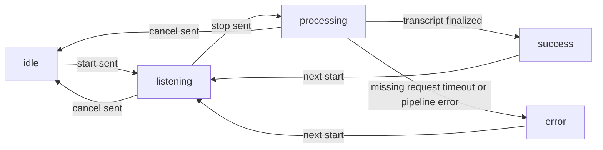
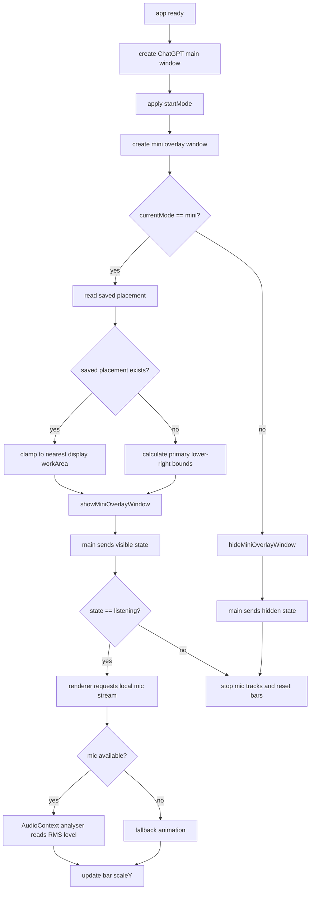
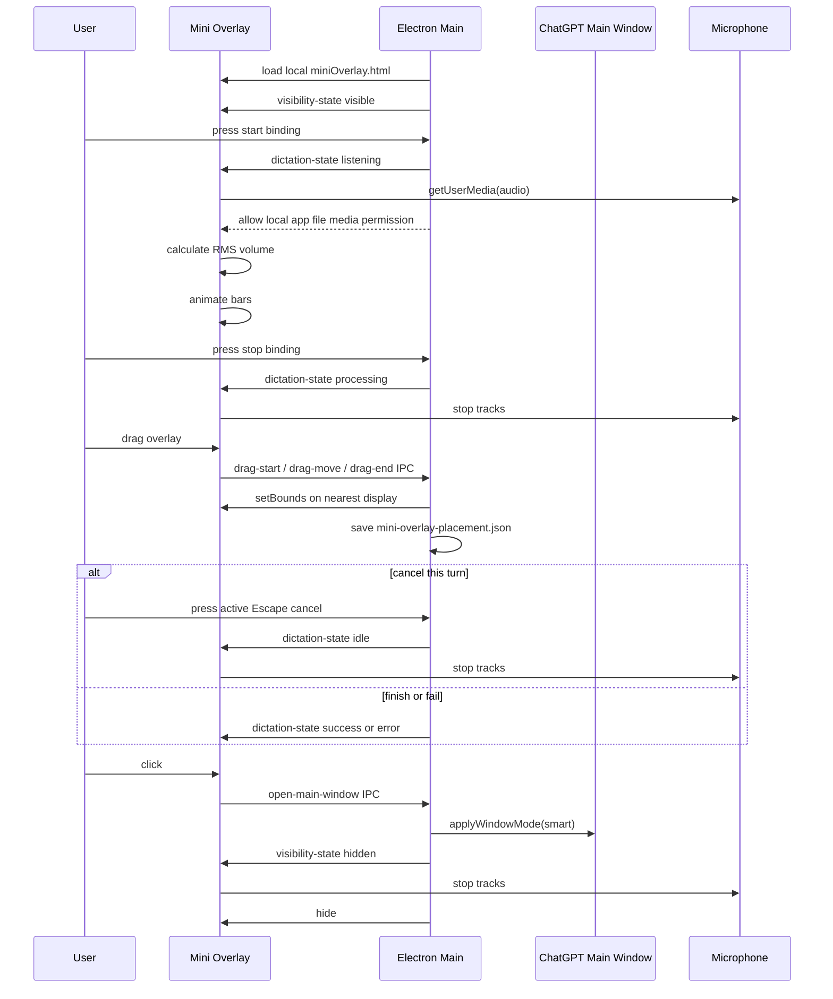

# Mini Overlay

## 目标

`mini` 模式把“最小化”从 ChatGPT 主窗口里拆出来：主窗口隐藏，显示一个独立的透明 overlay。第一次进入 mini 模式时 overlay 位于主屏右下角；用户可以拖动它到任意屏幕，位置会持久化。overlay 只在 `listening` 状态使用麦克风电平绘制柱状声波；待机、处理中、成功、失败状态不会读取本地 mic。

入口文件：

- [`../../src/main/miniOverlayWindow.js`](../../src/main/miniOverlayWindow.js)
- [`../../src/preload/miniOverlayPreload.js`](../../src/preload/miniOverlayPreload.js)
- [`../../src/renderer/miniOverlay.html`](../../src/renderer/miniOverlay.html)
- [`../../src/renderer/miniOverlay.css`](../../src/renderer/miniOverlay.css)
- [`../../src/renderer/miniOverlay.js`](../../src/renderer/miniOverlay.js)

## Public API

`buildMiniOverlayWindowOptions(preloadPath, iconPath, sessionPartition)`

构造 mini overlay 的 `BrowserWindow` 参数。关键属性是 `transparent: true`、`frame: false`、`focusable: false`、`skipTaskbar: true`、`alwaysOnTop: true`。

`calculateMiniOverlayBounds(displayWorkArea, options)`

根据主屏 workArea 计算右下角位置。默认尺寸是 `196x84`，默认距离右侧 `28px`、底部 `44px`。

`resolveMiniOverlayBounds(screenApi, options)`

根据保存位置或默认右下角计算 overlay bounds。保存位置使用 Windows 虚拟桌面的绝对坐标，因此支持左屏为负坐标、右屏为正坐标的多屏布局。

`calculateMiniOverlayDragBounds(startBounds, startPoint, currentPoint, screenApi, options)`

根据 drag 起点和当前鼠标屏幕坐标计算新 bounds。函数会选择当前鼠标最近的 display workArea，并把 overlay clamp 在该 display 内，避免拖到屏幕外找不回来。

`readMiniOverlayPlacement(storagePath)` / `writeMiniOverlayPlacement(storagePath, bounds)`

读取和保存 overlay 位置。默认保存到 `userData/mini-overlay-placement.json`。

`showMiniOverlayWindow(browserWindow, screenApi, options)`

显示 overlay，优先使用保存位置；没有保存位置时使用主屏右下角。显示时会设置 always-on-top 和 visible-on-all-workspaces，然后用 `showInactive()` 显示，避免抢 focus。

`hideMiniOverlayWindow(browserWindow)`

隐藏 overlay。

`setMiniOverlayFocusable(browserWindow, focusable)`

切换 overlay 是否可 focus。录音和处理中阶段保持不可 focus；成功和失败阶段允许 focus，方便用户选择文本和点击复制按钮。

## State Model

## Flowchart

## Time Sequence

## 边界

- overlay 的真实音量只来自本地 `getUserMedia`，不是 ChatGPT 网页内部录音流。ChatGPT 的录音仍然由网页自己控制。
- overlay 只有在 `mini` 模式可见且状态为 `listening` 时才读取麦克风；切到 `smart`、`corner`、`tiny`、`hidden`，或状态进入 `idle`、`processing`、`success`、`error` 后都会停止本地 mic tracks。
- `listening` / `processing` 是活跃听写状态，只有这两个状态会临时注册全局取消 binding。取消后回到 `idle`。
- 如果 Windows 系统隐私设置禁止 Electron 使用麦克风，overlay 无法获得真实音量，会显示 fallback 动画。
- overlay 在 `success` / `error` 结果态会临时允许 focus，让文本可选择、可复制；其他状态保持不可 focus。
- overlay 拖动使用 renderer 到 main 的受限 IPC，只传鼠标屏幕坐标，不暴露完整 ipcRenderer。
- 保存位置是虚拟桌面的绝对 x/y 坐标。屏幕布局变化后，下次显示会自动 clamp 到最近可用 display，避免窗口遗失在屏幕外。
