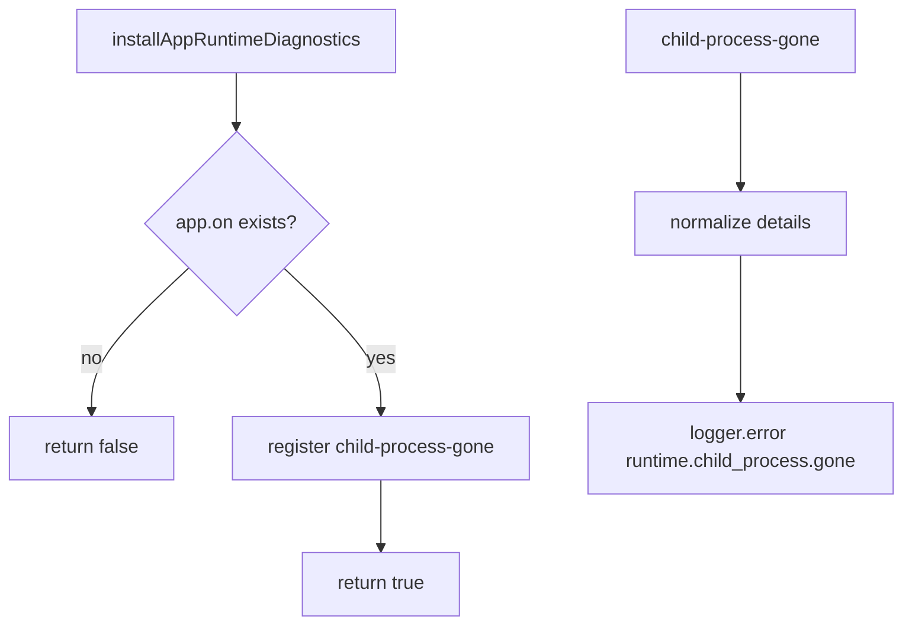
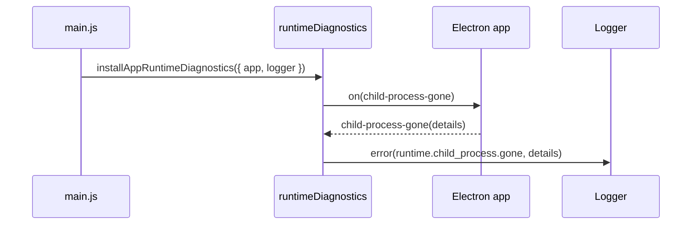
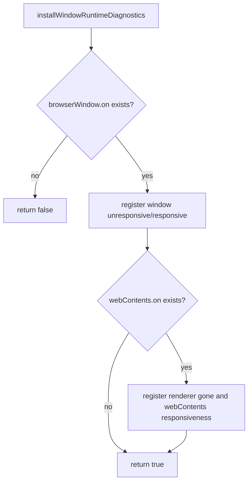
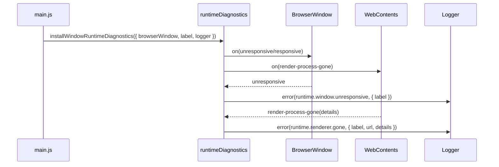

# Runtime Diagnostics

`runtimeDiagnostics` 给 Electron runtime 补充 hang / renderer gone / child process gone 日志。它不改变窗口生命周期，也不自动重启进程；它只把 Electron 自己能看到的异常边界写入现有 JSONL app log。

相关文件：

- [`../../src/main/runtimeDiagnostics.js`](../../src/main/runtimeDiagnostics.js)
- [`../../src/main/main.js`](../../src/main/main.js)
- [`../../tests/runtimeDiagnostics.test.js`](../../tests/runtimeDiagnostics.test.js)

## Public API

### `installAppRuntimeDiagnostics(options)`

给 Electron `app` 注册 `child-process-gone` listener。GPU、utility、renderer 等 native child process 异常退出时，写入：

```text
runtime.child_process.gone
```

Flowchart:



Time sequence:



### `installWindowRuntimeDiagnostics(options)`

给一个 `BrowserWindow` 和它的 `webContents` 注册窗口/renderer 诊断 listener。主 ChatGPT window 使用 label `chatgpt`，mini overlay 使用 label `mini-overlay`。

当前事件：

- `runtime.window.unresponsive`
- `runtime.window.responsive`
- `runtime.renderer.gone`
- `runtime.web_contents.unresponsive`
- `runtime.web_contents.responsive`

Flowchart:



Time sequence:



## Debugging Use

当 Windows WER 只记录 `AppHangB1` 时，先对照 app log 最后一条业务事件，然后看 hang 前是否有这些 runtime events：

```text
%APPDATA%\Dandelion\logs\app-YYYY-MM-DD.log
C:\ProgramData\Microsoft\Windows\WER\ReportArchive\AppHang_Dandelion...\Report.wer
```

如果 app log 有 `runtime.window.unresponsive`，优先看对应 `label` 的窗口。若只有 WER report，没有 runtime event，问题可能发生在 native message loop、系统层等待、或 Windows 直接关闭进程之前 logger 没来得及 flush。
