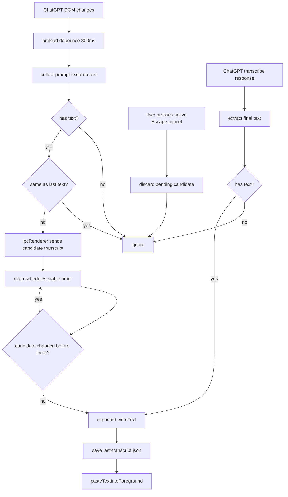
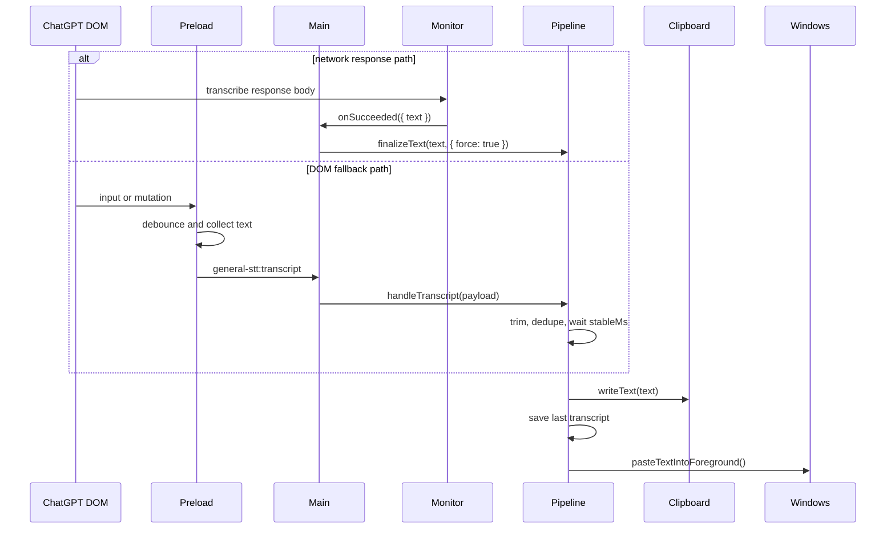

# Transcript Pipeline

## 目标

Transcript pipeline 负责把 ChatGPT 语音转写文本送回系统当前输入框。它支持两种来源：

- network monitor：读取 ChatGPT transcribe response body，拿到最终文本后立即完成。
- preload：在 ChatGPT 页面中观察 DOM，提取输入框或最新用户消息文本，作为 network 不可用时的 fallback。

main process pipeline 统一负责去重、写剪贴板、保存最后完成文本、触发 Windows `Ctrl+V`。DOM 来源会先等待文本稳定；network 来源已经是最终 response，所以可以立即完成。

相关文件：

- [`../../src/preload/chatgptPreload.js`](../../src/preload/chatgptPreload.js)
- [`../../src/main/transcriptPipeline.js`](../../src/main/transcriptPipeline.js)
- [`../../src/main/windowsPaste.js`](../../src/main/windowsPaste.js)
- [`../../src/main/foregroundWindow.js`](../../src/main/foregroundWindow.js)

## Public API

### `createTranscriptPipeline(options)`

创建 main process transcript pipeline。

参数：

- `clipboard`：Electron clipboard 兼容对象，必须支持 `writeText(text)`。
- `pasteText`：系统粘贴函数。
- `storagePath`：最后完成 transcript 的 JSON 保存路径。
- `stableMs`：候选文本稳定多少毫秒后视为完成，默认 `2500`。
- `restoreLastToClipboard`：启动时是否把上次完成文本写回剪贴板，默认 `true`。
- `logger`：可选 logger。

返回：

- `handleTranscript(payload)`：处理一次 transcript payload。
- `finalizeText(text, options)`：立即完成指定 transcript。`options.force` 为 `true` 时跳过去重，用于 network response。
- `flushPendingTranscript()`：立即完成当前候选 transcript。
- `discardPendingTranscript()`：丢弃当前候选 transcript，用于取消听写；不会修改最近一次完成文本。
- `copyLastTranscriptToClipboard()`：把最近一次完成文本重新写入剪贴板。
- `getLastText()`：读取最近一次已处理文本。

可选 callback：

- `onFinalized({ text, autoPaste, pasted })`：候选文本稳定、写入剪贴板和本地存储后触发。
- `onError({ message, text, error })`：写剪贴板、写存储或粘贴过程中发生异常时触发。

### `normalizeTranscriptPayload(payload)`

从 preload payload 中提取并 trim 文本。

### `pasteTextIntoForeground()`

在 Windows 上通过 PowerShell SendKeys 发出 `Ctrl+V`。非 Windows 环境返回 `false`，避免测试机触发真实按键。

## Flowchart

## Time Sequence

## 测试覆盖

测试文件：

- [`../../tests/transcriptPipeline.test.js`](../../tests/transcriptPipeline.test.js)
- [`../../tests/windowsPaste.test.js`](../../tests/windowsPaste.test.js)

覆盖内容：

- payload 文本标准化。
- 候选 transcript 稳定前不会复制或粘贴。
- 稳定后的新 transcript 会写入 clipboard、保存本地并调用 paste。
- `finalizeText(text, { force: true })` 可以把相同文本重新写入 clipboard，用于 network response 消除 processing 误报。
- `discardPendingTranscript()` 会丢弃本轮候选文本，不写 clipboard、不 paste、不修改上一次完成文本。
- 启动时会把上次完成 transcript 恢复到剪贴板。
- Windows PowerShell 粘贴命令构造。
