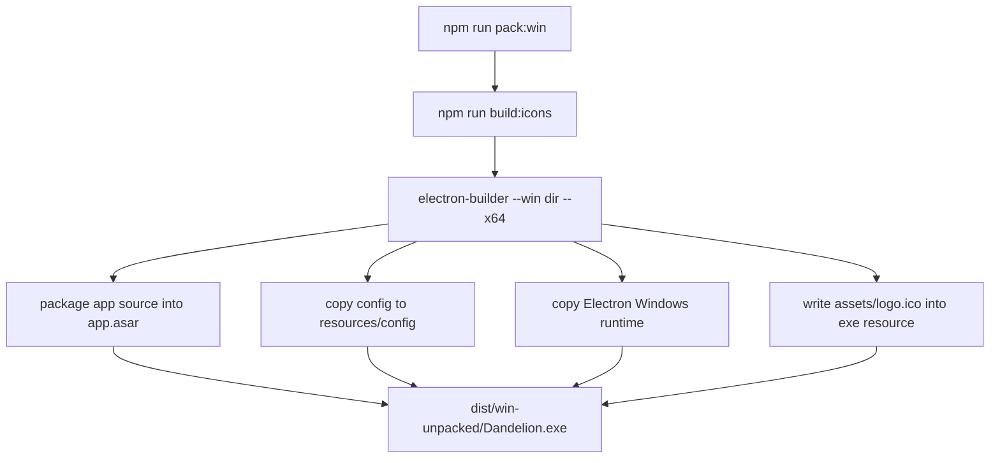
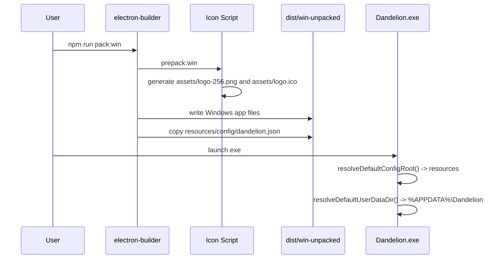

# Windows Packaging

## 目标

Windows packaging 使用 `electron-builder` 生成 Windows x64 app。当前主要产物是可直接运行的 unpacked 目录：

```text
dist/win-unpacked/Dandelion.exe
```

相关文件：

- [`../../package.json`](../../package.json)
- [`../../scripts/buildWindowsIcon.js`](../../scripts/buildWindowsIcon.js)
- [`../../src/main/appConfig.js`](../../src/main/appConfig.js)
- [`../../config/dandelion.json`](../../config/dandelion.json)
- [`../../tests/appPackaging.test.js`](../../tests/appPackaging.test.js)

## Public API

### `resolveDefaultConfigRoot(runtimeProcess)`

开发模式返回仓库根目录；packaged Electron runtime 返回 `process.resourcesPath`。这样 packaged app 默认读取：

```text
resources/config/dandelion.json
```

### `resolveDefaultUserDataDir(runtimeProcess)`

开发模式返回仓库 `.runtime/dandelion-electron`；packaged Electron runtime 返回：

```text
%APPDATA%\Dandelion
```

### `isPackagedElectronRuntime(runtimeProcess)`

判断当前是否是 packaged Electron app。开发模式 `electron .` 会被识别为非 packaged。

## Commands

```bash
npm run build:icons
```

从 [`../../assets/logo.png`](../../assets/logo.png) 生成 Windows 打包需要的 256x256 [`../../assets/logo-256.png`](../../assets/logo-256.png) 和 [`../../assets/logo.ico`](../../assets/logo.ico)。`pack:win` 和 `dist:win` 会自动先运行这个命令。

```bash
npm run pack:win
```

生成 `dist/win-unpacked`。这个命令适合在 WSL/Linux 中交叉打 Windows 目录产物。

```bash
npm run dist:win
```

生成 portable exe。portable 目标更依赖 Windows 打包环境；如果在 WSL/Linux 中失败，优先使用 `pack:win` 产物。

## Flowchart



## Time Sequence



## 注意事项

- `config/dandelion.json` 作为 `extraResources` 输出到 `resources/config`，不依赖启动目录。
- 登录态、权限、日志和最后一次 transcript 不写入安装目录，避免安装目录只读。
- 当前 Windows exe icon 使用 [`../../assets/logo.ico`](../../assets/logo.ico)。因为写入 exe resource 需要 Windows resource editor，带图标的 `pack:win` 建议在 Windows PowerShell/cmd 中运行；如果在 WSL/Linux 中直接交叉打包，可能仍需要安装 `wine`。
